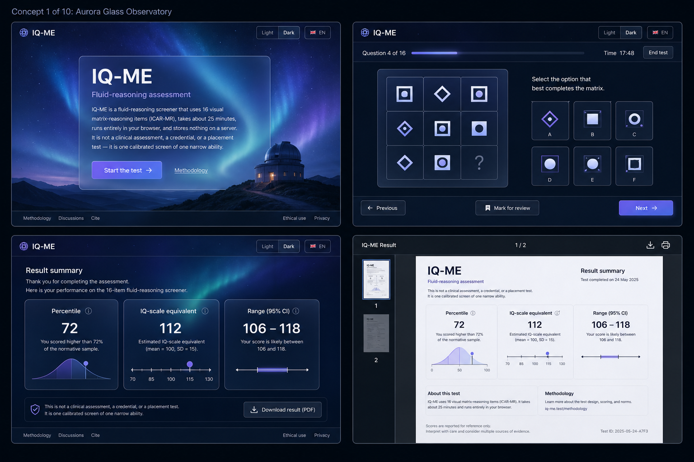
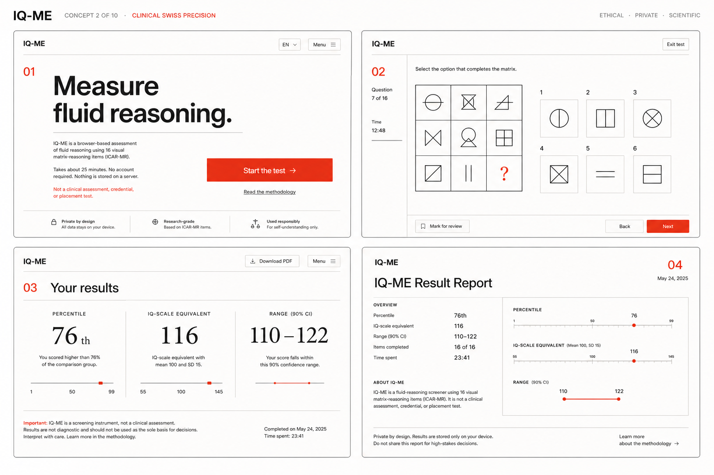
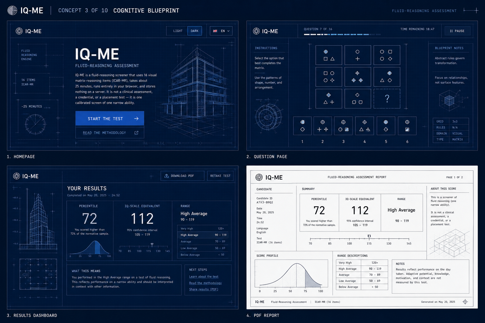
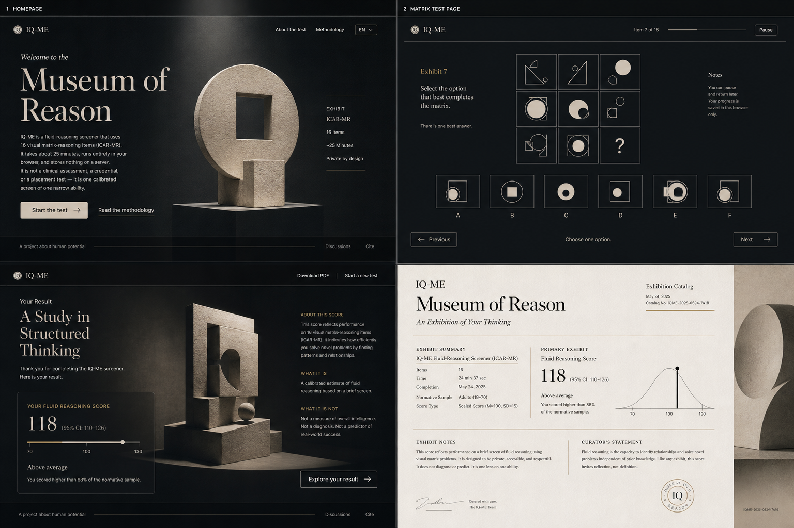
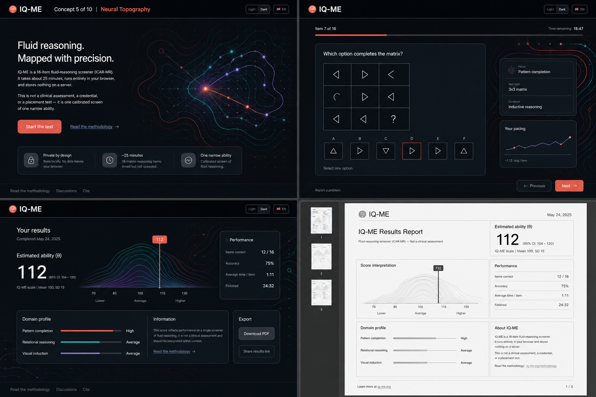
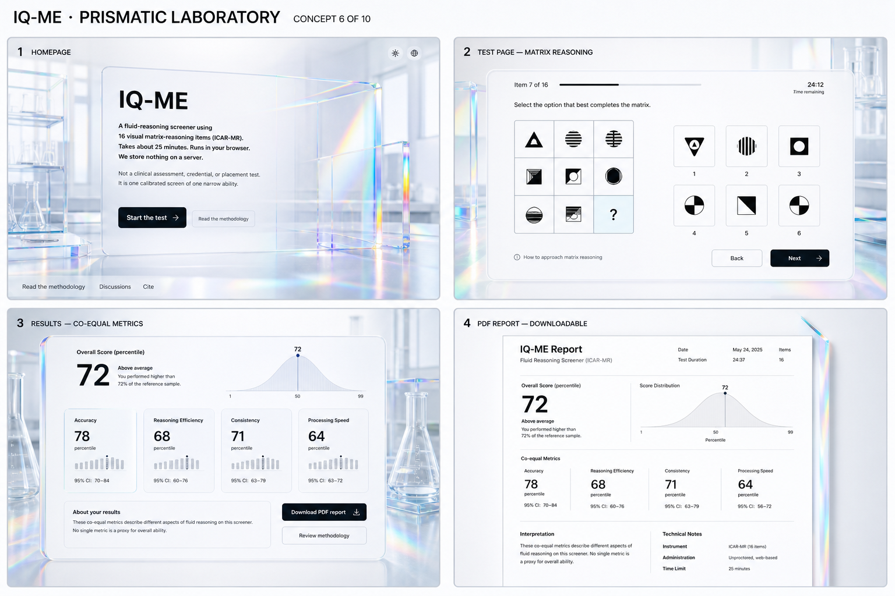
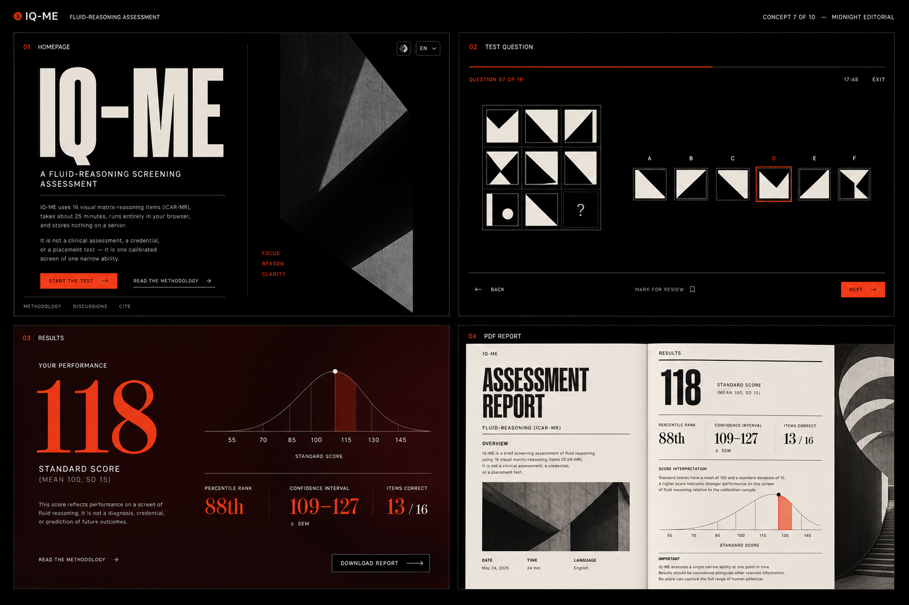
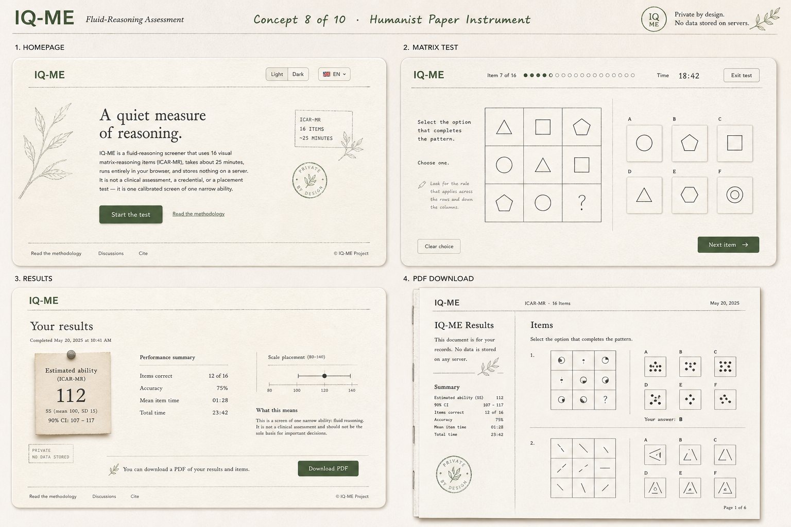
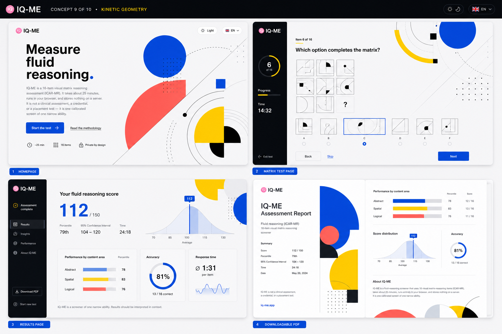
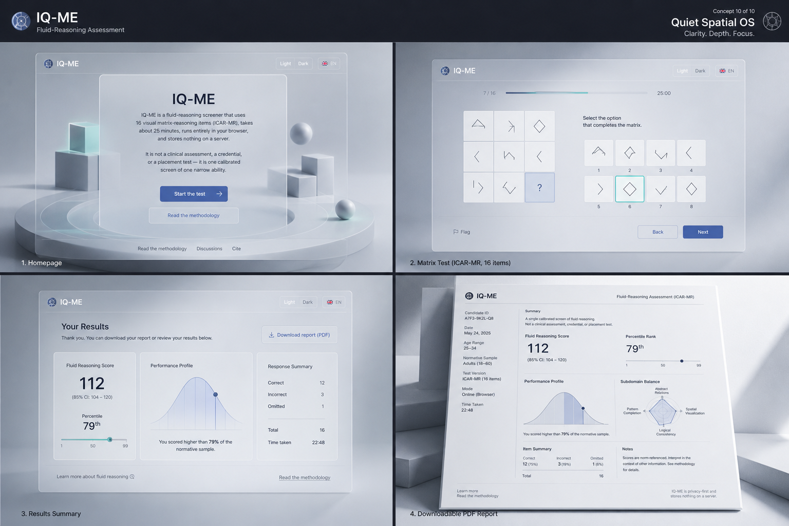

# Epic 13 Redesign Concept Gallery

Ten visual-system directions generated after the Epic 13 investigation found
that the implemented glass treatment produced too little perceptible change.

Each concept board explores four coordinated product surfaces:

1. Homepage / landing scene
2. Matrix-reasoning test page
3. Result page
4. Downloadable / printable result document

These images are directional mockups, not implementation specifications.
Generated text and fine UI details must be replaced with the project's real
content, accessibility requirements, and interaction contracts.

## Recommended Shortlist

### 1. Cognitive Blueprint

Best fit for the current scientific-instrument positioning. It creates a strong,
recognizable identity from matrix geometry, drafting marks, and technical
annotation without implying clinical precision or turning the test into a game.

### 2. Clinical Swiss Precision

Best low-risk implementation direction. It relies on typography, grid, spacing,
and one controlled accent rather than expensive effects. It also translates
cleanly into an intentional printable document.

### 3. Quiet Spatial OS

Best evolution of the intended glass direction. It uses visible layer separation,
backdrop variation, and depth, solving the same-color-on-same-color problem found
in the Epic 13 investigation.

## Concepts

### 01. Aurora Glass Observatory

**Direction:** Deep-navy spatial backdrop, luminous blue-violet aurora gradients,
legible frosted panels, thin glowing grids, and scientific typography.

**Strengths:** Makes glass and blur visibly meaningful; dramatic homepage and
results; clear continuity with the original Epic 13 intent.

**Risks:** Requires strict performance, contrast, and reduced-motion controls.
The visual effects could distract from matrix items if not suppressed during the
test route.

### 02. Clinical Swiss Precision

**Direction:** Warm-white editorial canvas, black ink, one vermilion accent,
oversized typography, asymmetric grid, crisp rules, and generous whitespace.

**Strengths:** Trustworthy, distinctive, accessible, fast, and naturally suited
to both browser and print surfaces.

**Risks:** Needs careful responsive typography and grid adaptation to avoid
feeling rigid on narrow screens.

### 03. Cognitive Blueprint

**Direction:** Cobalt blueprint field, cyan drafting lines, measurement marks,
technical annotations, schematic panels, and geometric matrix motifs.

**Strengths:** Creates a memorable identity directly related to reasoning and
matrix structure; works especially well for test progress and methodology links.

**Risks:** Dense drafting decoration could compete with the actual puzzle.
The test page should use a quieter subset of the visual language.

### 04. Museum of Reason

**Direction:** Contemporary museum identity with charcoal and bone surfaces,
large serif titles, sculptural geometric forms, brass rules, and archival catalog
print styling.

**Strengths:** Premium, calm, humane, and excellent for methodology and result
presentation.

**Risks:** Can feel overly ceremonial for a short browser assessment. Serif
display typography must not reduce test readability.

### 05. Neural Topography

**Direction:** Near-black analytical canvas with coral, teal, and lavender
topographic contours, connection paths, translucent panels, and elegant data
visualization.

**Strengths:** Visually distinctive and strong for result explanation and
progressive reveal.

**Risks:** Brain-like imagery may accidentally imply neurological or clinical
validity. Copy and visuals must explicitly avoid that interpretation.

### 06. Prismatic Laboratory

**Direction:** Bright research-lab environment with milky-white surfaces,
translucent prismatic acrylic, controlled spectral refractions, chrome edges,
and crisp black typography.

**Strengths:** Optimistic, modern, visually rich, and more effective than the
current flat glass implementation.

**Risks:** Refraction effects can become decorative noise and may be expensive
to render. Print needs a restrained translation rather than literal replication.

### 07. Midnight Editorial

**Direction:** Avant-garde digital magazine with black and burgundy fields,
large condensed type, sharp cropping, red-orange accent, and dramatic editorial
rules.

**Strengths:** Strongest typography-led dark-mode identity; excellent result
numerals and narrative pacing.

**Risks:** Aggressive editorial styling may feel intimidating or sensational.
Body copy and controls require conservative treatment.

### 08. Humanist Paper Instrument

**Direction:** Warm recycled-paper texture, graphite and dark-green ink,
precise hand-drawn diagrams, subtle stamps, and readable humanist typography.

**Strengths:** Private, calm, approachable, and naturally consistent with a
downloadable report.

**Risks:** Paper textures must remain subtle to preserve contrast and byte
budgets. Hand-drawn cues must not make the scoring feel informal.

### 09. Kinetic Geometry

**Direction:** Saturated cobalt, acid yellow, coral, and black geometric forms;
dynamic asymmetric layouts; repeated circles, squares, arcs, and trajectories.

**Strengths:** Boldest and most memorable direction; directly connects to visual
matrix reasoning.

**Risks:** Highest distraction and gamification risk. The test route would need
an intentionally reduced, neutral variant.

### 10. Quiet Spatial OS

**Direction:** Fog-gray dimensional environment, floating translucent panels,
strong edge definition, calm indigo and mint accents, subtle depth, and precise
typography.

**Strengths:** Achieves a visible glass system through backdrop and layer
contrast while staying calm and trustworthy.

**Risks:** Requires careful shadows, contrast, and mobile simplification.
Without a disciplined backdrop system it could repeat the current Epic 13
failure.

## Cross-Surface Design Constraints

- Keep the test route visually quieter than landing and results.
- Preserve co-equal Percentile / IQ-scale equivalent / Range treatment.
- Do not imply a clinical diagnosis, credential, or placement decision.
- Preserve full keyboard operation and WCAG 2.2 AA contrast.
- Collapse decorative motion under `prefers-reduced-motion`.
- Translate the visual identity into an ink-economical printable document
  instead of screenshotting the screen design.
- Add rendered screenshot review or visual-regression coverage. Structural CSS
  checks alone are insufficient.

## Related Investigation

See [Epic 13 appears visually unchanged](epic-13-no-visible-changes-investigation.md)
for the cause that prompted these explorations.
