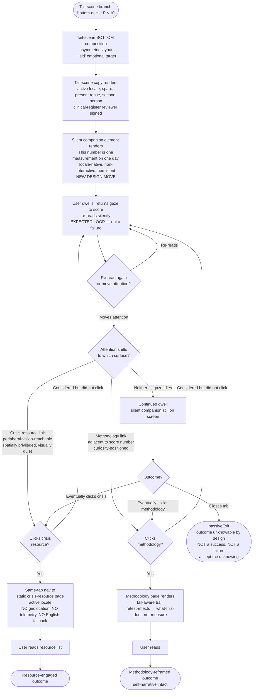
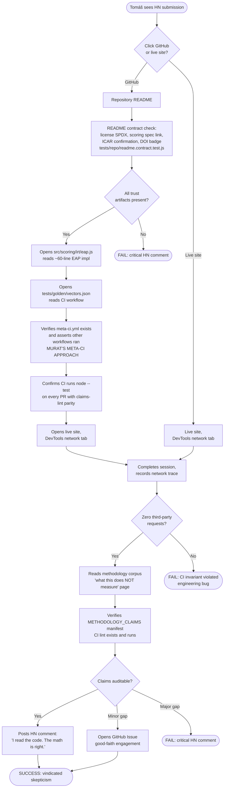
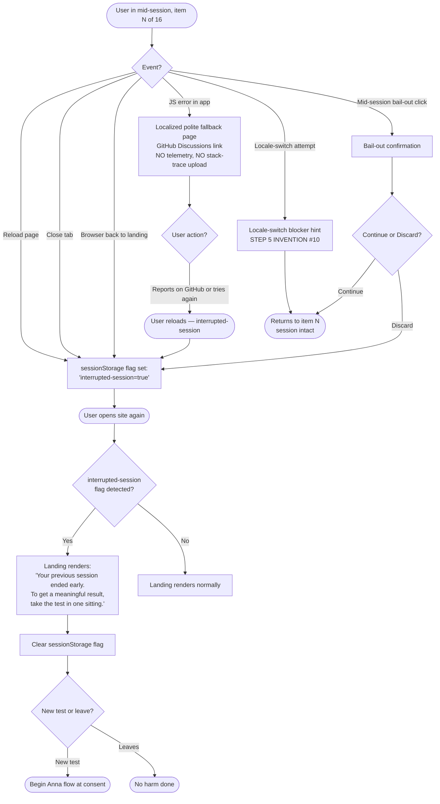

# UX Design Specification IQ-ME

**Author:** CEP
**Date:** 2026-05-15

---

<!-- UX design content will be appended sequentially through collaborative workflow steps -->

## Executive Summary

### Project Vision

IQ-ME is a free, ad-free, telemetry-free, citation-backed fluid-reasoning (Gf) screener in English, Russian, and Polish, built on the publicly-licensed ICAR Matrix Reasoning item pool and IRT 2PL EAP scoring. It is structurally non-commercial (MIT-licensed code, CC-BY-NC-SA content, no entity, no revenue, no exit) — the structural posture is itself the competitive moat that funded incumbents cannot replicate without burning their funnel.

From a UX perspective, IQ-ME is three coupled artifacts under one repository, in descending order of design-budget intensity per surface:

1. **The score-delivery ceremony** (the product). The result page is a ritual with stakes, not a route. Per-language clinical-register translators sign off on the bottom-decile and top-decile copy as a launch gate.
2. **The assessment SPA** (the floor). Landing → consent (with validity envelope) → 16-item test → pre-reveal beat → ceremony.
3. **The methodology corpus** (the second product, plausibly outlives the first). A static-site scholarly publication — Diátaxis-quadrants-plus-Narrative, 30 pages × 3 locales, masthead-first page chrome, Zenodo DOI per release, "Cite this page" widget, hreflang, ScholarlyArticle JSON-LD. Readable and citable without ever taking the test.

### Load-Bearing UX Hypothesis

**Score-delivery generates methodology curiosity.** The product's coupling stands only if a non-trivial fraction of testers who see their score click into the methodology corpus and engage with it. If false, the "three coupled artifacts" framing collapses to two artifacts plus a museum, the ceremony has no second act, and the corpus exists only for citers and skeptics — a meaningful audience, but not the underserved primary one.

This hypothesis is operationalized in §"UX Success Tests" below as a falsifiable threshold, not deferred to the qualitative 12/15 launch gate.

### UX North-Star

Anna (PL, mid-band) clicks from her score to the methodology page and reads, in Polish, a plain-language explanation of what the score does and does not mean. That click is the conversion event for trust-through-transparency. The methodology page must reward it.

### Target Users — Six Capability Tests

The PRD's six journeys are not personas to validate; they are **pass/fail capability tests** that the v1 UX must clear. Each test is testable.

| # | User | The asymmetric duty | Pass/fail capability test |
|---|---|---|---|
| 1 | **Anna** (PL, mid-band) | Native-feeling localization, restraint-first ceremony, methodology link rewards curiosity | Polish UI reads as authored not translated (per-language reviewer sign-off); methodology-click rate within 60s of reveal exceeds the §"UX Success Tests" threshold |
| 2 | **Mikhail** (RU, bottom-decile, 16) | **Asymmetric scene**: harm-mitigation copy readable in the cognitive state of *already-distressed* — short sentences, no modal dismissal required, native-language crisis resource at finger reach, no English fallback in the path, retest discipline visible | Bottom-decile copy passes a "readable while crying" line-length + reading-level + cognitive-load review; Russian-clinical-register reviewer signs off; native-language crisis-resource list is in-bundle and reachable in ≤1 tap from the score |
| 3 | **Daria** (PL, top-decile, postgrad) | Anti-credentialization composition; no screenshot crops cleanly to a decontextualized score | Cropping-fuzzer test (Murat) passes: every crop intersecting the IQ string also surfaces the uncertainty band string AND a caveat substring OR a visible "tear edge" overlay |
| 4 | **Tomáš** (HN skeptic, code-first) | README and repo as UX; DevTools verifies zero third-party fetches in 30s; scoring engine readable as shipped | README masthead reads as a trust artifact (license summary, scoring spec link, ICAR confirmation, DOI badge); live-site network trace passes Playwright zero-third-party assertion |
| 5 | **Karolina** (PL Wikipedia editor, citer-only) | The "60-second test": on her first methodology page, she completes a citable workflow without ever taking the test | All six Karolina-60s checks pass (see §"Methodology Corpus" below) |
| 6 | **Marek** (translator-contributor) | `CONTRIBUTING.md`, the issue template, parity-linter feedback, and the per-language reviewer-of-record loop are his UX | A first-time contributor can open a content-key PR, receive parity-lint feedback, and reach a per-language reviewer-of-record from repo discovery alone, in under 30 minutes |

**Implication for IA:** Mikhail's scene and Daria's scene are *compositionally distinct* result-page renders that share a typographic system, not the same composition with different copy slotted in. The synthesis treats tail-asymmetry as a load-bearing structural decision, not a content-key swap.

### Key Design Challenges (committing to rules, not principles)

1. **Score-delivery ceremony — committed beat vocabulary.** The reveal is a sequence of named beats with a default timing and a `prefers-reduced-motion: reduce` instant-render fallback. Beats:
   - **`landing`** — final-item submission accepted; "Your result is ready" frame.
   - **`pre-reveal`** — explicit user gate ("Show me / Not yet"); non-skippable.
   - **`anchor`** — point estimates (percentile + IQ-scale) render together.
   - **`band`** — uncertainty band renders, visually co-equal, **same frame as anchor under `prefers-reduced-motion`**, or following anchor by ≤ 600ms otherwise.
   - **`interval`** — qualitative ability band label renders.
   - **`context`** — per-item-difficulty breakdown renders.
   - **`tail-scene`** — bottom-decile harm-mitigation, mid-band contextualization, or top-decile anti-credentialization copy renders; **non-dismissible**.
   - **`methodology-handoff`** — links from score elements to methodology pages become active; numbers below this beat are interactive, not before.

   Each beat is instrumented via a `data-reveal-stage` attribute on a known root element and a custom in-page DOM event `iqme:reveal-stage` with `{stage, t}` — telemetry-free, used by Playwright (Murat) and stripped from production HTML in the build only if a measurable size win materializes.

2. **Anti-screenshot composition — committed rule.** *No viewport of the result page that surfaces the IQ-scale numeral surfaces it without also surfacing, visually contiguous and in the same viewport, both (a) the uncertainty-band string and (b) at least one inline non-dismissible caveat substring.* A "tear-edge" overlay on the score panel signals to the user (and to the cropping-fuzzer test) that the panel is composed as one inseparable unit. Enforced by Murat's cropping-fuzzer test; residual failures escalate to named human reviewer pre-launch.

3. **Co-equal typographic weight — committed numbers.** Percentile, IQ-scale, and uncertainty-band labels meet **all** of:
   - bounding-box area ratios within ±15% pairwise
   - font-size delta within 2px
   - vertical baseline alignment within 4px
   - `font-weight` differential ≤ 100
   - color-contrast ratio against background equal within ±0.5

   Operationalized as a Playwright `getBoundingClientRect()` + computed-style suite. Optical/whitespace/motion dominance is residual — flagged for design review with a screenshot diff posted to the PR.

4. **Tri-lingual measurement equivalence as visible UX surface.** Block-level content keys with EN source hash per RU/PL entry. **The stale-translation banner is a load-bearing trust signal, not a CI artifact**:
   - rendered as a dated, per-page hatnote (Wikipedia "needs updating" pattern)
   - in the accessibility tree (`role="status"`), not visual-only
   - includes the EN source date and the date the translation last reviewed
   - the discipline is named in product copy: drift is *visible*, not hidden.

5. **Validity envelope honesty over a11y theatre.** Matrix items are visuospatial by construction. The consent scene declares this in each language ("This test is visual. Users who cannot perceive 2D visual matrices will not receive a meaningful score from this instrument."). WCAG 2.2 AA holds on all non-item surfaces. Synthetic alt-text on items is forbidden.

6. **Methodology corpus as publication, not docs.** Page chrome is a *masthead*, not a footer — title + version + DOI + last-reviewed date + named author/reviewer appear **above the first paragraph**. A "stable URL for this version" toggle sits next to "latest." IA uses **Diátaxis-plus-Narrative** — the fifth bin (Narrative) houses the tail-scenes-explainer pages, the harm-mitigation framing pages, and any page whose primary register is "museum placard." See §"Methodology Corpus" for the Karolina-60s checklist.

7. **Three explicit absences as enforced negative space.** No share UI. No certificate. No badge. No `navigator.share()` reference in shipped JS. No `og:image` generated per-result. Enforced as a CI negative-assertion suite; failures block PRs. The absence is part of the product, not an oversight.

8. **Failure poetics — designed error states for the ceremony.** The ceremony has named, designed failures, not unhandled seams:
   - Mid-reveal reload → landing page; no resume; explicit copy that the session was lost intentionally.
   - Mid-session locale switch attempt → blocked at the locale switcher; an in-page hint explains measurement invariance.
   - Refused tail-scene → impossible by design (tail-scene is non-dismissible and renders inline, not as a modal).
   - JS error mid-session → localized polite fallback page; GitHub Discussions link; no resume attempt; no auto-telemetry.

9. **Aesthetic departure from the prototype.** The v1 visual identity is sober, modern, restraint-first — closer to a scientific instrument or a journal article than to a playful quiz site. `iq-me.html`'s warm-serif "paper" aesthetic is the *anti-reference*. The prototype is removed from the repo on day one of the new architecture (per PRD MVP scope).

### Design Opportunities

1. **Score-delivery ceremony as a reusable beat-vocabulary pattern** — the `landing / pre-reveal / anchor / band / interval / context / tail-scene / methodology-handoff` shot list is reusable for v1.1 ICAR subtests and for the roadmap adaptive-testing scene.
2. **Co-equal-weight typography as a named design pattern.** The point-estimate-plus-uncertainty typography rule is novel enough to be worth naming ("co-equal triplet") and documenting in the methodology corpus as a sample of honest-instrument design.
3. **Methodology corpus as a citable publication surface.** Masthead-first page chrome, "Cite this page" widget, version pinning, ScholarlyArticle JSON-LD, hreflang. Plausibly outlives the test in citation value (Journey 5 + 6).
4. **README and repository as UX for the skeptic-verifier (Tomáš).** Primary surfaces: README masthead, scoring engine source readable in isolation, `tests/golden/vectors.json`, `METHODOLOGY_CLAIMS` manifest, CI workflow.
5. **EAP-shrinkage-toward-the-mean diagram** — one panel, raw likelihood + prior + posterior, reused across locales. Makes "your score got pulled toward 100 because we're uncertain" viscerally intuitive for non-specialists. The PRD names many widgets; it does not yet name this one.
6. **Reading-level + glossary-first writing as design discipline.** Forces precision; enforces translation parity; makes the corpus usable by Wikipedia editors, course instructors, journalists.
7. **Mirror-readiness as UX invariant.** Relative asset paths throughout. The site works identically on GitHub Pages, Codeberg Pages, and Cloudflare Pages. Russia-access contingency built in from v1.

### Methodology Corpus — Karolina's 60-Second Checklist

On her first methodology page, Karolina (PL Wikipedia editor, never takes the test) must complete every item below in one glance each:

1. See the page title, version, DOI, and license without scrolling.
2. See a one-sentence plain-language lede (newspaper-style).
3. Find the "Cite this page" affordance without searching.
4. Reach a glossary term by hover/tap, not by navigation.
5. Confirm the page exists in her language and is not stale-banner-flagged.
6. Locate the primary-source citation for the claim she is about to quote.

Any item failing one-glance breaks the Wikipedia-editor capability test.

### UX Success Tests (operationalizing the qualitative gate)

The PRD's "12/15 tester credibility" launch gate is qualitative. The UX synthesis adds operational sub-gates that automation buys before humans see the build:

| # | Test | Threshold | Method |
|---|---|---|---|
| 1 | Methodology-click hypothesis | ≥ X% of testers click a methodology link within Y seconds of `methodology-handoff` beat; ≥ Z% can articulate the validity envelope unprompted in post-test interview | Tester observation log; X/Y/Z numbers calibrated in pilot |
| 2 | Cropping-fuzzer | 100% of generated crops surfacing the IQ string also surface uncertainty + caveat substrings, or intersect a tear-edge overlay | Playwright + tesseract.js, ~1800 crops per scene per release |
| 3 | Co-equal triplet | All four computed-style thresholds pass on percentile / IQ / band | Playwright + computed-style assertions per PR |
| 4 | Reveal-stage ordering | `iqme:reveal-stage` events fire in committed order; inter-stage delta ≥ design minimums | Playwright event-trace per PR |
| 5 | Karolina-60s checklist | All six items pass one-glance review on every methodology-page template | Pre-launch manual review per language; visual-regression for masthead-region invariants |
| 6 | Negative-space absences | No share UI, no certificate, no badge, no `navigator.share()` in bundled JS, no per-result `og:image` | CI negative-assertion suite + static grep |
| 7 | Stale-translation banner in a11y tree | When EN source hash drifts, banner renders with `role="status"` and a dated label | Playwright a11y-tree assertion |

Failure on any of #2–#7 blocks PR merge; #1 informs the qualitative launch gate rather than gating engineering.

### Notes on Framing (commitments this synthesis makes that the PRD did not)

- **Mikhail is asymmetric, not a copy-key variant.** Bottom-decile composition, reading-level discipline, line-length cap, no-modal-dismissal, native-language crisis-resource reach distance are first-class design constraints.
- **The methodology-curiosity hypothesis is named as falsifiable**, not decoration.
- **Karolina's 60-second checklist is the corpus's pass/fail capability test**, encoded explicitly.
- **The ceremony's beat vocabulary is committed**, not metaphor.
- **The anti-screenshot rule is one declarative composition rule**, not a vibe.
- **Co-equal weight is four numeric thresholds**, not "look balanced."
- **The stale-translation banner is UX**, not CI.
- **The ceremony has designed error states**, named four of them.
- **A fifth Diátaxis bin (Narrative)** is declared so tail-scenes aren't forced into how-to.
- **The EAP-shrinkage diagram is a v1 corpus artifact**, named.

## Core User Experience

### Defining Experience

The core user action IQ-ME optimizes for in v1 is **the score → methodology click**: a user, having received their result, clicks from any number on the result page (percentile, IQ-scale value, uncertainty band, qualitative-band label) to the methodology page that defines it, in their active language, and reads.

This commits the design budget hierarchy:

1. **The result page (apex surface).** Receives the largest design budget. The ceremony — beat sequence, anti-screenshot composition, co-equal typography, tail-scenes, methodology-handoff — is the work.
2. **The methodology page reached from the result-page click (second surface).** Receives the second-largest design budget. The masthead, lede, "Cite this page" widget, glossary affordance, and visual hierarchy must reward the click within ~5 seconds of arrival, or the core user action fails its second half.
3. **The consent scene and the test runner (the floor).** Receive sufficient design budget to clear the consent ethics and the deliberation discipline, but are not where the experience-success/failure pivot lives.

This hierarchy is a deliberate choice over alternatives ("complete an honest session" — would skew budget to test-runner integrity; "survive receiving a score" — would skew budget to the bottom-decile scene). The chosen apex surface is testable via the methodology-click hypothesis (§"UX Success Tests" #1 in Project Understanding).

### Platform Strategy

**Targets:**

- **Form factor:** mobile-first responsive web, single static deployment serving phone / tablet / desktop. No native apps. No PWA install prompt. No service worker for v1 (cache-invalidation conflict with methodology-claims manifest parity — deferred to v1.x).
- **Browsers:** Chrome / Chromium-derived (incl. Yandex Browser as a v1 launch gate), Firefox, Safari (macOS + iOS), last 24 months evergreen. ES2022 baseline, CSS Custom Properties, `:focus-visible`, `prefers-color-scheme`, `prefers-reduced-motion`, container queries where supported with `@media` fallback. No transpilation.
- **Architecture:** hybrid SPA + multi-page static. Assessment surface is a hash-routed SPA. Methodology corpus is path-based static HTML per page (for SEO, citability, Wikipedia compliance).
- **Deployment:** GitHub Pages canonical; Codeberg Pages or Cloudflare Pages as same-day mirror failover. Relative asset paths throughout. The site renders byte-identically under any of the three hosts.
- **Offline:** v1 does not support offline use. The assessment is one session, online, single device. The methodology corpus is reachable from Internet Archive and Software Heritage mirrors if the canonical site is blocked, but not via in-browser cache.

**Primary input modality (committed): keyboard-first, touch-equivalent on mobile.** This is the load-bearing input decision and an unconventional one for mobile-first design — it deserves explicit justification because it shapes component design, focus management, and the visual language of affordances.

Rationale:

- **Measurement integrity.** Keyboard navigation produces a more consistent input cadence than touch (no thumb-position variance, no accidental-swipe rate, no scroll-conflict-with-tap ambiguity). For an instrument whose validity rests on deliberation, the input modality should reward deliberation rather than reflex.
- **Accessibility convergence.** A keyboard-first design serves screen-reader users, motor-impaired users, and the validity-envelope-honest non-item surfaces by construction. Touch is added as a peer modality, not retrofitted on top of touch-first design.
- **Skeptic-verifier alignment.** Tomáš (HN skeptic) uses keyboard primarily; the design vocabulary should feel native to him, not feel like a phone app ported to desktop.
- **Aesthetic alignment.** Sober, scientific-instrument visual identity reads more naturally with keyboard-affordance vocabulary (explicit focus rings, Tab-traversal cues, modifier-key hints) than with touch-first patterns (large pills, swipe affordances, gesture hints).

**Operational implications:**

- All interactive elements have `:focus-visible` styles that are first-class visual design, not afterthought outlines.
- Tab order is logical and verified manually pre-launch.
- Item options use native `<input type="radio">` with associated `<label>` — not custom-div widgets — to inherit native arrow-key navigation within the radio group.
- Touch targets meet the WCAG 2.2 AA ≥ 44 × 44 px minimum, but they are not the primary affordance vocabulary — they are the touch-equivalent rendering of a keyboard-first affordance.
- A small "Keyboard shortcuts" hint appears on the consent scene in each language (Tab / arrow keys / Enter), not as a tutorial but as a quiet signal to the keyboard-using audience that the design respects them.
- No swipe gestures (FR alignment: deliberation > reflex).
- No `navigator.share` (already a committed absence; the keyboard-first framing reinforces it).

**Methodology corpus reachability from inside the SPA (committed):**

- **Visible:** landing page, consent scene, result page (methodology-handoff beat), all footers across landing / consent / result / methodology pages.
- **Hidden:** item runner screens (the test itself). The test-runner screens treat the user's attention as a measurement surface — corpus links would invite mid-session navigation that conflicts with deliberation.
- **Footer treatment elsewhere:** a small, dated, role-marked "Methodology corpus · v<X>.<Y>.<Z>" link with locale awareness. Honors the "corpus is one click away" framing without competing for attention with item-presentation chrome.

### Effortless Interactions

The design budget for "effortless" follows the apex surface — what should feel weightless at the moments where weight would kill the experience:

- **Landing → consent → first item.** Zero preconditions. No cookie banner. No consent dialog above the consent scene itself. No language picker friction (default from `Accept-Language`; explicit switcher available; choice persisted only on explicit user click). The path from URL-arrival to first matrix item is uncluttered, fast (FCP < 1.5s on mid-tier Android over 3G), and feels native in all three languages.
- **Item-to-item movement.** One item per view. Progress visible at all times (`aria-live="polite"` + `aria-current="step"`). Answer-revision is allowed (FR2) until final submission, surfaced as a keyboard-first affordance (Shift+Tab or explicit "Previous" button — both work). No countdown. No per-item timer. No timing-based penalty.
- **Last item → score appearance.** The pre-reveal beat ("Show me / Not yet") is the only thing between the last item submission and the anchor render. No spinner on score computation (the EAP math runs in < 100ms by construction). The score appears *as if it had been there all along* — no loading indicator, no progress bar, no "computing your result" surface. This is a UX win extracted from a technical floor (NFR3).
- **Score → methodology click.** Every displayed number is a one-click portal to the methodology page that defines it, in the user's active language, with the methodology page's masthead immediately visible without scrolling. The click is the apex effortless interaction.
- **Methodology page → cite-this-page.** Karolina's first 60 seconds (six one-glance items) are effortless by design. The "Cite this page" widget is reachable without searching; APA + Wikipedia-template citations copy to clipboard in one click; the Zenodo DOI is visible in the masthead.
- **Stale-translation drift made visible, not invisible.** A reader on a drifted RU/PL page sees the dated hatnote at the top of the page rather than reading silently-stale content. The discipline shows itself.

### Critical Success Moments

Each moment below is named, designed, and tied to a §"UX Success Tests" operational gate (Project Understanding section).

1. **Landing-page first-paint.** The first 1.5 seconds are the trust handshake. No cookie banner, no consent dialog, no signup. The user sees: project name, one-sentence framing in their language, "Start the test / Read the methodology" twin-CTA, language switcher. Failure here breaks every downstream journey (Anna, Mikhail, Daria all begin here).
2. **Consent scene completion.** The user reads the validity envelope (matrix items are visuospatial; the instrument is a self-paced screener, not a credential; result may surprise you) and elects Continue or Not today. The Continue control is enabled only after the disclosure is rendered (FR12). Failure mode: the user dismisses without reading; mitigation is composition (no skip button, no "I agree" pre-check), not enforcement.
3. **Mid-session deliberation.** The user works through 16 items without distraction, with progress visible and no time pressure. Failure modes: accidental advance (mitigated by explicit Next, no swipe-advance); accidental locale switch (blocked by FR8); accidental tab-close mid-session (no resume; named-loss reset on return). Recovery on return uses a sessionStorage flag to detect interrupted-session and renders the "previous session ended early" copy on the landing page (per Mid-Session Loss commitment).
4. **The pre-reveal beat.** "Your result is ready. It is one estimate with a range around it. Show me / Not yet." This is the only deliberate pause in the experience. Failure mode: the user feels rushed; mitigation is non-skippable composition and dwell-friendly copy. The beat is instrumented via `iqme:reveal-stage` event with `stage: "pre-reveal"`.
5. **The reveal — anchor + band.** The point estimate and the uncertainty band render co-equal (numeric thresholds in Project Understanding §Key Design Challenges #3). Under `prefers-reduced-motion: reduce`, they render in the same frame; otherwise the band follows the anchor by ≤ 600ms. The anti-screenshot composition rule activates here (caveat substring + band substring in the same viewport as the IQ numeral). **This is the make-or-break visual moment.**
6. **The tail-scene render.** Bottom-decile, mid-band, or top-decile scene renders non-dismissibly, inline, in the user's language, written by a clinical-register native speaker (not translated from English). Per-language reviewer-of-record signs off pre-launch. Failure mode for Mikhail (the asymmetric case): the copy reads cold, clinical, paternalistic, or English-translated; mitigation is the launch gate (≥ 4/5 native-speaker testers per language report copy feels honest).
7. **The methodology-handoff click.** The core user action. Every displayed number is interactive at this beat and not before. Failure mode: the user does not click; the load-bearing UX hypothesis is falsified for this user. Aggregate failure (low click-through rate across testers) is the §"UX Success Tests" #1 metric and feeds back into ceremony copy and methodology masthead design rather than into a feature change.
8. **Karolina's arrival on a methodology page from outside.** A citer arrives via search or Wikipedia. The first paint must clear the six-item 60-second checklist. Failure mode: the page reads like docs, not like a publication — the masthead is missing, the lede is buried, the citation widget is in a footer. Mitigation is the corpus-page template, version-pinned and reviewed.
9. **The skeptic's DevTools verification.** Tomáš opens DevTools, hits Record on the Network tab, completes a full session. The trace shows only same-origin GET requests. Failure mode: a single third-party request slipped in. Mitigation is the Playwright zero-third-party assertion in CI (NFR6 + Test #6); engineering catches this before Tomáš sees it.

### Experience Principles

Seven principles, each a commitment the v1 UX makes and each pointing back to the apex action or to a tested gate. Stated as "we do X because Y" rather than as adjectives.

1. **Restraint over affect.** The score is rendered with deliberate visual restraint — no celebratory color, no animated typography, no large hero number alone. Restraint is the message: this is an estimate, not a verdict. Tested via co-equal-triplet computed-style assertions and anti-screenshot cropping fuzzer.
2. **Honesty over polish on validity.** Where the instrument has limits (visuospatial only, norming-sample bias, retest practice effects), the limits are surfaced in product copy rather than smoothed over. The stale-translation banner is the canonical example: drift is visible by default. Tested via a11y-tree banner assertion and reading-level lint per language.
3. **Deliberation over reflex.** No swipes. No timers. No "are you sure" confirmation churn. Item revision is allowed. The pre-reveal beat is non-skippable. The input vocabulary is keyboard-first because keyboard rewards deliberation. Tested via reveal-stage event ordering and manual Yandex Browser pass.
4. **The corpus is a destination, not a footnote.** Methodology pages are published as scholarly artifacts with mastheads, DOIs, named reviewers, versioned permalinks, and "Cite this page" widgets above the fold. The corpus is reachable without taking the test and is plausibly the longer-lived artifact. Tested via Karolina's 60-second checklist.
5. **The result page is a scene, not a route.** Beat vocabulary (`landing / pre-reveal / anchor / band / interval / context / tail-scene / methodology-handoff`) is committed; the reveal is sequenced; the tail-scene is non-dismissible; the methodology-handoff click is the apex action. Tested via `iqme:reveal-stage` events and the methodology-click hypothesis.
6. **Mikhail's scene is asymmetric.** The bottom-decile composition is not the top-decile composition with a different copy key — it is a compositionally distinct render sharing typography. Crisis-resource reach distance is ≤ 1 tap. No English-fallback in the path. Reading-level discipline accounts for cognitive load under distress. Tested via per-language clinical-register sign-off as a launch gate.
7. **Designed absences are part of the product.** No share button. No certificate. No badge. No `navigator.share()`. No `og:image` per result. No cookie banner. No analytics consent dialog. No email capture. The absences are enforced as a CI negative-assertion suite and read as intentional, not omitted. Tested via the negative-assertion suite.

## Desired Emotional Response

### Primary Emotional Goals

IQ-ME's emotional design is deliberately countercultural for a consumer web product: it does not optimize for affect, delight, excitement, accomplishment, or any of the standard positive-engagement palette. The target emotions are narrow, restrained, and earned rather than provoked:

1. **Trust, by visible mechanism.** The user feels they can verify, not that they must believe. Trust is the umbrella goal under which every other emotional choice operates. It is earned by visible structure (zero third-party fetches, source on GitHub, citations on every claim, named reviewers, DOI permanence) rather than by language ("we promise...").
2. **Earned confidence in the score.** Not "you're smart" or "you're not smart" — confidence that the number rendered is the number the methodology describes, with the uncertainty the methodology acknowledges. The confidence belongs to the *measurement*, not to the person measured.
3. **Earnest curiosity at the methodology-handoff.** The apex emotional moment. The user clicks because they want to understand, not because they have been manipulated into clicking. Curiosity is the conversion event.
4. **Dignity across the tails.** Mikhail leaves with self-narrative intact. Daria leaves without a credential to misuse. Anna leaves informed. The product treats all three with the same restraint; the dignity is in the absence of differential affect-engineering.

What IQ-ME **explicitly does not aim to make users feel**:

- **Delighted.** Delight is the language of products that need to win attention. IQ-ME is found by reputation; the score-delivery is not a delight surface.
- **Empowered, accomplished, validated.** These emotions create false confidence in numbers that are estimates with uncertainty bands.
- **Excited.** Excitement is incompatible with restraint. The reveal is designed against excitement.
- **Reassured.** False reassurance is harm. The product offers context, not comfort.
- **Inspired.** The product is an instrument, not a motivational tool.
- **Belonging or community.** There is no community surface. The product is one-user, one-session, one-device by design.

### Emotional Journey Mapping

**Landing-page first paint (trust handshake).** The dominant emotion is *quiet relief* — the user expected another scam funnel and is met with a clean, ad-free, signup-free, cookie-banner-free page in their language. Relief is the right word: it is the absence of a negative expectation, not the presence of a positive one. Visual mood: sober, instrument-like, immediate.

**Consent scene (informed-consent register).** The dominant emotion is *seriousness without solemnity*. The user reads the validity envelope and chooses Continue or Not today with full information. Mikhail's "Не сегодня" recognition (PRD Journey 2) — "most sites do not give him an out" — is the emotional target: the product respects that this is not always a good time.

**Mid-session (sustained attention without strain).** The dominant emotion is *focused calm*. No timer, no countdown, no progress anxiety, no per-item stakes. The user works at their own pace. Restraint is the message.

**Pre-reveal beat (deliberate pause).** The dominant emotion is *anticipation without dread*. "Your result is ready. It is one estimate with a range around it. Show me / Not yet." The pause is for the user to *opt in* to seeing the number — not a manufactured cliffhanger. The opt-in framing makes the next beat feel chosen, not inflicted.

**The reveal — anchor + band (the make-or-break moment).** The dominant emotion is *gravity without affect*. The numbers render with restraint, the uncertainty band visually co-equal, no celebratory or punitive color, no animated typography. The emotion is "this is a serious thing rendered seriously." Affect is absent on purpose.

**Tail-scene render (asymmetric by tail):**

- **Mid-band (Anna):** *quiet contextualization*. Mid-band copy contextualizes the score without flattening it; reading-level discipline holds; the methodology link is the obvious next step.
- **Bottom-decile (Mikhail):** ***held***. (The committed target — see below.) The product does not abandon the user with a number. Crisis-resource reach is ≤ 1 tap, in their language, no English fallback. The copy register is spare, present-tense, second-person, closer to a friend speaking than a counselor counseling. Recognition without diagnosis.
- **Top-decile (Daria):** *unwelcome friction with the impulse to share*. The composition makes the impulse to screenshot harder than the impulse to read the methodology. Anti-credentialization copy does its work without scolding. The user leaves with no certificate, no badge, and a methodology link.

**Methodology-handoff click (apex emotion, layered).** Three audiences arrive at the methodology page from the score, each with a different emotional register, and the page architecture serves all three in **layered hierarchy**:

- **Earnest curiosity (Anna's register, top of layer):** the lede — one plain-language sentence — invites reading. Visual mood at the top of the page is calm and scholarly. Curiosity is rewarded immediately.
- **Skeptical validation (Tomáš's register, mid-layer):** the falsifiable claim appears next, with its citation visible immediately. Visual mood shifts toward investigative — the claim is on display for falsification, not for assertion.
- **Quiet trust (Karolina's register, masthead-resident):** the named reviewer, the version, the DOI, the last-reviewed date appear in the masthead above the lede — the journal-article framing. Trust is offered by structure, not by tone.

The three are not competing layouts; they are spatial layers in the same template (masthead → lede → falsifiable claim → body), each serving a different arriving emotion.

**Karolina's arrival from outside (citation context).** The dominant emotion is *recognition of a citable artifact*. The masthead reads as a journal-article header. The "Cite this page" widget is present and visible without searching. The Zenodo DOI resolves. The page is what a Wikipedia editor expects an external link to be.

**Tomáš's repository visit (skeptic verification).** The dominant emotion is *the vindication of warranted skepticism* — "I came to verify and the verification works." README masthead, scoring engine source, golden vectors, methodology-claims manifest, CI workflow are all visible and runnable. The emotion is not surprise; it is the satisfaction of skepticism rewarded with evidence.

**Marek's first PR (contributor onboarding).** The dominant emotion is *welcome without ceremony*. The issue template asks for what is needed (language, page, content key, qualification in two sentences) without ceremony. The parity-linter feedback is clear. The reviewer-of-record is named and reachable. The new contributor's name appears in the changelog. The welcome is structural; there is no badge.

**Error states (the under-designed seams).** The dominant emotion across designed failures is *honest disappointment, not despair*:

- Mid-reveal reload → "Your previous session ended early. To get a meaningful result, take the test in one sitting." Honest, no resume, no shame.
- Locale-switch mid-session blocked → "Switching languages mid-session would change what is being measured. Finish or restart." No scolding.
- JS error → "Something went wrong. If this happens repeatedly, please report it on GitHub Discussions." No auto-telemetry, no error-modal anxiety.

### Micro-Emotions

The conventional micro-emotion pairs are mostly the wrong frame for IQ-ME. Below: the pairs that *do* matter, with the side actively designed for.

| Pair | Designed-for side | Reason |
|---|---|---|
| Trust vs skepticism | **Vindicated skepticism**, not bypassed skepticism | The user's skepticism is welcomed and rewarded with verifiable structure rather than smoothed over with copy. Tomáš's emotion. |
| Confidence vs doubt | **Calibrated confidence in the measurement**, not confidence in the person measured | The number has uncertainty; the *uncertainty* is what is rendered confidently. |
| Curiosity vs satiation | **Curiosity that opens, not closes** | The result page is not the answer — it is the question. The methodology page is the next breath, not the period. |
| Recognition vs anonymity | **Recognized in context, not anonymized** | Mikhail's "the product knows this might land badly for me." Daria's "the product knows top scores are misused." |
| Dignity vs condescension | **Dignity** | Across the tails, regardless of result. Active prevention against paternalism in the tail-scenes. |
| Earned-trust vs default-trust | **Earned-trust** | The trust posture is offered as inspectable, not asserted. The product expects the user to verify; verifying is part of the experience. |
| Restraint vs affect | **Restraint** | Affect is the language of extractive products. Restraint is the language of honest instruments. |

### Emotions Actively Prevented (Co-Equal Failure Modes)

Three emotions, each of which — if it occurs in a tester — constitutes a UX failure. None is privileged over the others; the v1 launch gate includes three named pre-launch tester check-ins, one per failure mode.

1. **False confidence (Daria failure).** A top-decile tester walks away believing the number is a credential they can share. **Mitigations:** anti-screenshot composition (cropping fuzzer), anti-credentialization copy (per-language clinical-register reviewed), restraint typography (co-equal triplet), absence of share/certificate/badge UI. **Pre-launch check-in:** ≥ 4/5 top-decile testers per language report the result did not feel like a credential to share without context. **If observed:** the project's anti-extractive posture is eroded; revise tail-scene copy and composition until the check-in passes.
2. **Shame (Mikhail failure).** A bottom-decile tester walks away with their self-narrative damaged. **Mitigations:** bottom-decile tail-scene composition (the "held" emotional target), crisis-resource reach distance ≤ 1 tap, per-language clinical-register sign-off as a launch gate, reading-level discipline tuned for cognitive load under distress. **Pre-launch check-in:** ≥ 4/5 bottom-decile testers per language report the score was delivered with care and at least one path forward existed in their language. **If observed:** this is the harm risk the project is most accountable for; do not ship below threshold even if launch slips.
3. **Paternalism (universal failure).** Any tester feels talked-down-to — over-explained, hand-held, validated, soothed, lectured. **Mitigations:** reading-level discipline (forces precision without dumbing down), glossary-first writing, no-modal-dismissal pattern, restraint in copy register, declarative composition over instructive flow. **Pre-launch check-in:** ≥ 4/5 testers per language across all bands report the copy feels honest and respectful rather than coddling. **If observed:** invalidates the trust posture for all six personas; revise copy register until the check-in passes.

Aggregate gate (carried from PRD): ≥ 12 of 15 testers (≥ 4/5 per language × 3 languages) report the experience felt honest and the result felt credible. The three failure-mode check-ins above are *sub-gates* of this aggregate — failure on any of the three blocks launch even if aggregate appears to pass.

### Design Implications

Each committed emotional target maps to specific UX design moves already named upstream (Steps 2 and 3); this section makes the emotion→design links explicit.

| Emotion target | UX design moves |
|---|---|
| Trust, by visible mechanism | Zero-third-party invariant (NFR6, tested); source readable as shipped (NFR21); methodology-claims manifest in repo (NFR23); README as masthead-style trust artifact; "Cite this page" widget; Zenodo DOI in masthead |
| Earned confidence in the score | Co-equal triplet typography (numeric thresholds); uncertainty-band rendered first-class; inline non-dismissible caveat above the score (FR23); per-item-difficulty breakdown (FR22) |
| Earnest curiosity at handoff | Methodology link reachable from every displayed number; methodology-page lede above the fold; visual mood of the methodology page is scholarly, not promotional |
| Dignity across the tails | Tail-scene asymmetric composition (not copy-key variants); per-language clinical-register sign-off as launch gate; no English fallback in crisis-resource path; restraint typography across all tails |
| Vindicated skepticism (Tomáš) | README + scoring engine source + golden vectors + CI workflow as a single visible trust surface; live-site DevTools verification < 30 seconds (NFR26); methodology-claims manifest visible in repo |
| Held (Mikhail) | Bottom-decile copy: spare, present-tense, second-person, native-language clinical register; crisis-resource list in-bundle, ≤ 1 tap; no English fallback; reading-level tuned for cognitive load under distress |
| Layered hierarchy at handoff | Methodology page template: masthead (trust) → lede (curiosity) → falsifiable claim with citation (validation) → body (extended reading) |
| Honest disappointment (errors) | Named loss copy on session interruption; in-place hint copy on blocked locale switch; localized polite fallback on JS errors; no error modals, no telemetry, no shame |

### Emotional Design Principles

Five principles, each a commitment that names what the v1 UX optimizes for emotionally and what it actively works against.

1. **Restraint is the message.** No celebratory or punitive affect anywhere in the product. The score is a serious thing rendered seriously. Affect is the language of extractive products; restraint is the language of honest instruments. (Reinforces Step 3 Principle #1.)
2. **Emotion is earned, not provoked.** Every target emotion in the v1 UX (trust, calibrated confidence, curiosity, dignity, vindicated skepticism, held-ness) is earned by visible structure rather than provoked by copy or interaction. The product does not manufacture feelings; it creates the conditions for them.
3. **Asymmetric care across the tails.** Mikhail's scene, Anna's scene, and Daria's scene are emotionally distinct renders, not the same composition with different copy keys. Asymmetric care is a load-bearing structural decision.
4. **Skepticism is welcomed, not bypassed.** Skeptics are core users; their skepticism is the trust mechanism. The verification surface (README, source, golden vectors, CI workflow, DevTools network trace, DOI) is itself UX.
5. **The product's absences are emotionally load-bearing.** No celebration. No share button. No certificate. No badge. No email capture. No cookie banner. No analytics consent dialog. No "you got X out of Y!" screen. Each absence is an emotional choice as much as a structural one; together they constitute the product's emotional register.

## UX Pattern Analysis & Inspiration

### Posture: Invent First, Validate Via Contrast

IQ-ME is a category-defining product, not a category-following one. The PRD already names this directly (§Innovation): the product's innovation is "a coherent set of structural, governance, and disclosure decisions" with no direct precedent in the free-IQ-test genre or in adjacent commercial domains.

This UX spec accordingly inverts the conventional inspiration step. The primary content here is not a curated list of adjacent products to model on — it is a registry of **IQ-ME-native design moves the v1 commits to inventing**. Adjacent references appear only as *contrast boundaries* (what we adopt one specific thing from, then diverge), and the anti-pattern section enumerates *genre moves the product refuses by design*.

Shopping for references is the wrong move when the product's emotional palette (trust without affect, dignity across the tails, vindicated skepticism), its structural posture (zero-third-party, runtime-zero-build, no commercial surface), and its category (free auditable psychometric instrument in three languages with co-published methodology corpus) are jointly novel.

The risk this posture creates: invented design vocabulary may not survive contact with real users. The mitigation is the operational test suite already named in Steps 2–4 — the cropping fuzzer, co-equal-triplet computed-style assertions, `iqme:reveal-stage` event ordering, Karolina-60s checklist, and the three failure-mode tester check-ins. Inventions are validated by named tests, not by precedent.

### IQ-ME-Native Design Vocabulary (v1 Committed)

Twelve design moves IQ-ME invents (or re-purposes from non-design domains) for v1. Seven were named upstream in Steps 2–4; five are committed this step.

**Named in Steps 2–4:**

1. **Co-equal triplet typography.** Percentile, IQ-scale, and uncertainty band rendered with four enforced numeric thresholds (bounding-box area ±15%, font-size ±2px, baseline ±4px, font-weight ≤100 delta). No precedent in the genre — competitor result pages universally privilege the IQ number typographically.
2. **Tear-edge overlay.** Anti-screenshot composition rule made visible as a designed UI element that signals "this panel is one inseparable unit" to the user (and to the cropping-fuzzer test). Anti-credentialization made structural, not editorial.
3. **Reveal-beat vocabulary + `iqme:reveal-stage` event hook.** Named beats (`landing / pre-reveal / anchor / band / interval / context / tail-scene / methodology-handoff`) with a custom in-page DOM event for telemetry-free instrumentation. The ceremony has a shot list and an API.
4. **Masthead-first methodology page chrome with stale-translation hatnote.** Hybrid of journal-article masthead (title, version, DOI, named reviewer, last-reviewed date above the lede) and Wikipedia "needs updating" hatnote pattern (drift made visible at the page top, not hidden in a footer or buried in metadata). The hybrid exists nowhere else.
5. **Asymmetric tail-scene composition.** Mikhail's bottom-decile scene, Anna's mid-band scene, and Daria's top-decile scene are compositionally distinct renders sharing a typographic system — not one composition with different copy keys slotted in. Asymmetric structural care, not asymmetric content.
6. **Karolina-60s checklist as a publication capability test.** A citer-on-first-arrival test with six one-glance pass/fail items, encoded as the corpus's primary template-quality gate. The genre has no precedent for treating a citation surface as a testable capability.
7. **Designed-absences as enforced negative space.** No share UI, no certificate, no badge, no `navigator.share()`, no per-result `og:image`, no cookie banner, no analytics consent dialog, no email capture — enforced as a CI negative-assertion suite. The absences are part of the product, not omissions.

**Committed this step:**

8. **Difficulty breakdown as a declarative sentence.** FR22's per-item-difficulty render is one prose sentence subordinate to the score — *"Harder items: 1 of 4 correct. Medium: 3 of 6. Easier: 5 of 6."* — typographically reading as a footnote that earns attention, not as a gamified chart, achievement badge, or percentage circle. Defends Principle #1 (restraint over affect) at the most affect-tempting place in the result page.
9. **Validity-envelope-first consent composition.** The consent scene surfaces the instrument's *limits* (visuospatial only, screener not credential, may surprise you) **before** the test description, not after. "Continue" and "Not today" render at emotionally equal visual weight — not the typical Continue-prominent / Not today-grey-link asymmetry. Copy register sits at the boundary between informed-consent (medical research) and product-onboarding (consumer) — closer to a museum-entrance placard than to either. The genre has no honest consent pattern; this is the invention.
10. **Locale-switch blocker as teachable moment.** When the user attempts to switch language mid-session (FR8 blocks it), the block renders as an in-place hint that names the *psychometric reason* in plain language: *"Switching languages mid-session would change what is being measured."* Not "your progress will be lost" (mechanical, friction-framing) and not a confirmation modal (affect-friction). The blocker becomes a teachable moment — a micro-instance of "drift is visible" applied to user action.
11. **Post-handoff tail-aware trail.** When the user clicks from their score to a methodology page (the apex action), the methodology page surfaces a curated **2-step trail** generated at result-page time, asymmetric by tail: mid-band sees `norming-sample → limitations`; bottom-decile sees `retest-effects → what-this-does-not-measure`; top-decile sees `anti-credentialization → norming-sample`. Not a "related articles" sidebar, not a "next chapter" affordance — a designed reading path that rewards the methodology-curiosity hypothesis and prevents a one-page bounce. This is the design move that directly tests the load-bearing UX hypothesis.
12. **Validity-envelope as a visual diagram.** Beyond Paige's EAP-shrinkage diagram (already named), the validity envelope itself is rendered as a *designed visual asset* — a labeled grid or annotated population-overlap diagram showing "valid for / partial validity / not valid for" populations explicitly. Reusable in the consent scene AND in `/methodology/constructs/validity-envelope/`. The diagram is the teachable form; prose is the supporting form, not the primary one.

The two v1 corpus diagrams (EAP-shrinkage + validity-envelope) are the designed-visual-asset budget for v1. Anything more is post-MVP.

### Boundaries, Not Models — What We Adopt One Thing From, Then Diverge

Six adjacent references are named here. For each: one specific element we adopt, and an explicit *but* clause naming what we diverge from. None of these is a template.

| Reference | What we adopt (one thing) | But we diverge on |
|---|---|---|
| **Mensa Norway** (test.mensa.no) | The *floor* — honest, ad-free, signup-free posture exists in the genre as proof-of-concept | …everything else: no methodology corpus, no multi-language beyond EN/NO, no IRT, no citation discipline, no uncertainty band visible by default. IQ-ME exceeds the floor on every other dimension. |
| **23andMe health-condition result** | The *single-result-with-uncertainty framing* — a number rendered with explicit uncertainty, clinical-register copy, methodology link as natural next step | …commercial framing, US-clinical-register copy, upsell paths, account requirement, share-to-family affordances, brand affect. IQ-ME inherits the restraint posture, not the visual or interaction language. |
| **Wikipedia (article + hatnote)** | The *hatnote pattern* — drift signals rendered at page top, dated, in-content. Also: the *external-link policy framing* for non-commercial citation surfaces. | …editorial chrome (edit history, talk page, version diffs as default UI). Wikipedia's chrome serves editors; IQ-ME's chrome serves citers and readers. |
| **arXiv / Nature article header** | The *masthead-first chrome idea* — title, version, DOI, named author surface above the lede, not in a footer | …academic-publishing register, paywall structures, citation-graph affordances, related-papers algorithms. IQ-ME's masthead is plain-language, free, and serves Wikipedia-editor-grade citers as much as it serves academics. |
| **Signal / Have I Been Pwned / EFF SSD** | The *verify-don't-trust posture* — source readable, claims falsifiable, no marketing-asserted trust | …protocol-spec audience and developer-tooling chrome. IQ-ME's verifiability surface (README, scoring engine source, golden vectors, CI) is one click for Tomáš but invisible to Anna. The trust posture is shared; the surface is product-tailored. |
| **Are.na / Stripe docs / scientific museum placards** | The *sober scholarly aesthetic* — restraint typography, generous whitespace, no brand affect | …brand identity, commercial register, audience (designers / developers / museum visitors). IQ-ME's aesthetic is restraint-first because the instrument requires it, not because the brand requires it. |

The pattern: each row adopts *one structural posture* and rejects *one or more specific implementations* of that posture. Adoption is structural; implementation is invented.

### Anti-Patterns — Genre Moves the Product Refuses

These are the design moves IQ-ME explicitly refuses. Each is one or more competitors' standard practice; the refusal is a product decision, enforced where possible by CI assertions (Step 3 Principle #7, Step 4 §Emotional Design Principles #5).

**From the free-IQ-test scam-funnel genre (123test, Brain Metrics Initiative, FreeIQTest, iq-test.cc family):**

- **Email-required-for-result paywalls** — refused. Result renders without any contact-data collection.
- **Newsletter signup overlays** — refused. No newsletter exists; no email capture exists.
- **Cookie consent banners** — refused. No cookies exist; the banner-genre itself is the dark pattern.
- **Animated score counters** ("Your IQ is unlocking…") — refused. The score appears with restraint, no countdown, no animation arc.
- **Certificate generators / shareable PDF badges** — refused. No certificate exists. No badge exists.
- **"You scored in the top X%!" status framing** — refused. Top-decile copy is anti-credentialization; bottom-decile copy is harm-mitigation; mid-band copy is contextualization. None is status framing.
- **Share-to-Twitter / share-to-VK / share-to-Facebook buttons** — refused. No `navigator.share` reference exists in shipped JS. No social-card image generated per-result.
- **"Compare your score to others" leaderboards** — refused. No leaderboard exists; no aggregate stats exist; no telemetry exists.
- **Push-notification consent at landing** — refused. No notifications exist.
- **Ads, anywhere** — refused. No ad surface exists.

**From over-modeled adjacent commercial products:**

- **23andMe's upsell paths** — refused. The result page has no "want more?" affordance, no related-test offers, no premium tier.
- **Academic publishing's paywall chrome** — refused. The methodology corpus is free, no DOI redirects through a paywall, no "request access" flow.
- **Wikipedia's edit-history-as-default-visible chrome** — refused. The corpus is published artifact, not collaboratively-edited surface; history lives in `/reference/changelog/` for citers who need it, not in the page chrome.
- **Reddit-style voting affordances on methodology content** — refused. Methodology pages are reviewed-and-signed, not voted-on.
- **Hacker News / comment-thread affordances on results or methodology** — refused. Feedback is GitHub Discussions only; no inline comment surface.

**From over-eager UX patterns (good ideas in the wrong context):**

- **Progress gamification** — refused. The progress bar is a state indicator, not a reward surface; no XP, no levels, no streaks, no achievement unlocks.
- **Onboarding tours / interactive tutorials** — refused. The product introduces itself via the consent scene; no overlay walkthrough exists.
- **Empty-state illustrations with personality** — refused. Error states are honest disappointment, not character moments.
- **"Skip" affordances on educational/methodology content** — refused. The pre-reveal beat is non-skippable; the tail-scene is non-dismissible.
- **Toast notifications, snackbars, ephemeral feedback popups** — refused. Feedback surfaces are in-place and persistent.

### Design Inspiration Strategy

**Strategy: invent first, validate via contrast.**

For every UX surface in v1:

1. **Start from the product's emotional palette and structural posture.** Restraint, dignity across tails, vindicated skepticism, trust-by-visible-mechanism. Adjacent commercial products do not share this palette.
2. **Check the six "boundaries-not-models" references for contrast.** What would *they* do here, and why is the IQ-ME thing different? The contrast is the design move's justification.
3. **Check the anti-pattern register.** If a proposed design move appears in the anti-pattern list, the move is rejected without further argument.
4. **Validate via the named test suite.** Cropping fuzzer, co-equal-triplet thresholds, `iqme:reveal-stage` event ordering, Karolina-60s checklist, negative-assertion suite, stale-translation banner a11y assertion, per-language tester check-ins. Invention is hypothesis; tests are falsification.

**What this strategy explicitly forbids:**

- Treating any adjacent product (23andMe, Mensa Norway, etc.) as a *template* rather than as a *contrast boundary*.
- Importing affordance vocabulary from commercial products without testing against Principle #1 (restraint over affect).
- Borrowing copy registers from adjacent domains without per-language clinical-register sign-off.
- Justifying a design move by "[product X] does it this way" without naming the structural reason it serves IQ-ME's posture specifically.

**What this strategy commits the v1 build to producing:**

- The 12 IQ-ME-native design moves enumerated above, each named in downstream IA / wireframe / component-inventory / state-design steps (Steps 6–10).
- A test suite that operationalizes each invention's success criterion.
- A repository-level register of design moves (this section) that future contributors can reference when proposing UX changes via PR.

## Design System Foundation

### Design System Choice

**A custom, hand-rolled, token-driven design system built on vanilla CSS Custom Properties, with zero npm runtime dependencies, no preprocessor, no build step for stylesheets, system-font stacks, and a two-layer token architecture (primitives + semantic).**

This is the only viable choice given the platform constraints declared upstream:

- **NFR21** — runtime-zero-build invariant; no compiled / bundled / minified / transpiled artifacts in production.
- **NFR33** — zero npm runtime dependencies in production.
- **NFR32** — solo-dev cognitive load budget; the system must be mindable end-to-end.
- **Step 3 Platform Strategy** — no CSS preprocessor; CSS Custom Properties and native CSS only.
- **NFR6 + CSP** — no third-party fonts; no third-party stylesheet hosts.
- **No bundler / no import map** — ES modules loaded directly via `<script type="module">` with relative paths.

Frameworks and framework-coupled design systems (Material Design, Ant Design, MUI, Chakra UI, Tailwind UI, Radix, shadcn/ui) are disqualified by these constraints — not by aesthetic preference. The platform substrate forces a custom system; the IQ-ME-native design vocabulary committed in Step 5 makes the custom system desirable rather than merely tolerated.

### Rationale for Selection

1. **The constraint stack forecloses the menu.** Every off-the-shelf system either requires a build step, ships an npm runtime dependency, embeds framework coupling, or pulls third-party assets. None survive the runtime-zero-build invariant. The "choice" is genuinely forced.
2. **The product's IQ-ME-native design moves require custom CSS anyway.** The co-equal triplet typography (four numeric thresholds across percentile / IQ / band), the tear-edge overlay (anti-screenshot composition), the asymmetric tail-scene composition (Mikhail/Anna/Daria scenes structurally distinct), and the masthead-first methodology page chrome are all design moves that no off-the-shelf system ships as components. We were going to write the load-bearing CSS regardless; doing so on a clean foundation is the lower-overhead path.
3. **Solo-dev cognitive load budget favors the custom system.** A vanilla CSS + tokens stack at ~300–500 lines is mindable in one sitting. An imported system at ~2000+ lines of framework conventions is not.
4. **The auditability surface (Innovation #5; Tomáš journey) extends to the stylesheet.** Tomáš opens DevTools and reads the CSS — it must be readable as written, not minified, not preprocessed, not generated by an opaque build. Hand-rolled tokens + semantic CSS is the auditability-extending choice.
5. **Aesthetic alignment.** The "sober, restraint-first, scientific-instrument visual identity" (Step 3 §9) reads more naturally with system fonts and plain CSS than with a framework's component aesthetic.

### Implementation Approach

**Stylesheet architecture (committed):**

- `/css/primitives.css` — raw token values, no semantic meaning. Color scale (e.g. `--color-neutral-50` through `--color-neutral-950`; `--color-accent-*` if needed), type scale (`--font-size-100` through `--font-size-900`), space scale (`--space-1` through `--space-12`), motion primitives (`--motion-duration-fast/base/slow`, `--motion-ease-*`), radii, layout constants. Pure values; no component knowledge.
- `/css/semantic.css` — semantic tokens that map primitives to use cases: `--color-text-body`, `--color-text-muted`, `--color-surface-elevated`, `--color-rule-divider`, `--font-size-score-anchor`, `--font-size-band-label`, `--space-section-gap`, `--motion-reveal-anchor-to-band`. Light-mode values declared at `:root`; dark-mode values declared at `:root[data-theme="dark"]` and `@media (prefers-color-scheme: dark) :root:not([data-theme="light"])`.
- `/css/reset.css` — minimal, opinionated reset (~30 lines). No third-party reset.
- `/css/base.css` — body, typography defaults, link defaults, focus styles (`:focus-visible` first-class).
- `/css/components/*.css` — one file per component (e.g. `score-panel.css`, `tail-scene.css`, `masthead.css`, `progress-indicator.css`, `stale-translation-hatnote.css`, `validity-envelope-diagram.css`).
- `/css/utilities.css` — small set of utility classes for layout primitives only (`.cluster`, `.stack`, `.center`). No utility-CSS-as-design-language.
- `/css/index.css` — single aggregator that `@import`s the above in order: reset → primitives → semantic → base → components → utilities. The single `<link rel="stylesheet" href="/css/index.css">` per page entry-point.

**Two-layer token architecture (committed):**

- **Primitives layer** is colour/type/space/motion scales as raw values. The scales are explicit and visible — no algorithmically-generated palettes, no opaque chroma transforms. The primitive set is small enough to fit on a printed cheat sheet.
- **Semantic layer** is the contract the components consume. Components never reference primitives directly; they reference semantic tokens (`--color-text-body`, not `--color-neutral-900`). This is the layer that retunes for dark mode, for RTL (deferred — not v1), for an eventual high-contrast theme.

The two-layer pattern is industry-standard (Radix, Material Design v3, Apple HIG all use a variant of it). IQ-ME adopts the structural pattern; the token *set itself* is invented for the product's restraint-first palette, not borrowed.

**Typography (committed): system font stacks.**

- `--font-family-sans:` SF Pro Text / Segoe UI / Roboto / Helvetica Neue / system-ui fallback. Default for UI surfaces and assessment SPA.
- `--font-family-mono:` Menlo / Consolas / Liberation Mono / monospace. Used only for citation strings, DOI rendering, and any code surface.
- No self-hosted custom fonts in v1. No serif family for methodology corpus (the hybrid option was rejected — single typographic register across both surfaces preserves cognitive coherence and zero-CLS discipline).
- Reading-level legibility: enforced font sizes per surface (semantic tokens), generous line-height (~1.55 body, ~1.35 headings), measure capped at 65ch for prose, max width on `<main>` for methodology corpus.

**Dark mode (committed): explicit tri-state toggle.**

- Default: System. The toggle defaults to honoring `prefers-color-scheme`; no `localStorage` write occurs on page load.
- User-explicit override via a tri-state toggle (System / Light / Dark) in the app-chrome footer on landing, consent, result, and methodology surfaces. Hidden on item-runner screens (consistent with Step 3 §"Corpus access" — the test-runner screens are an attention surface, not a chrome surface).
- Clicking Light or Dark writes a single `localStorage` key (`theme=light` or `theme=dark`) — the only `localStorage` write triggered by app-chrome interaction. Clicking System clears the key.
- Theme application: `:root[data-theme="dark"]` overrides semantic tokens; `:root[data-theme="light"]` overrides too. With no `data-theme` attribute, CSS falls back to `@media (prefers-color-scheme: dark)`.
- Dark mode is **a separately-designed palette**, not an auto-inverted one (NFR15). Both palettes meet WCAG 2.2 AA contrast.
- Toggle is keyboard-first (per Step 3 platform strategy): native `<button role="switch">` semantics or a `<fieldset>` with radio inputs; Tab-navigable, arrow-key-navigable within the group, `:focus-visible` styles.

### Customization Strategy

**What the system commits to being:**

- **Small.** ~300–500 LOC of token CSS at v1. Components add another ~200–400 LOC across all surfaces. Total style budget ≤ ~1500 LOC of hand-written CSS shipped to the browser, gzipped.
- **Versioned with the corpus.** A `/methodology/reference/design-tokens/` page in the corpus (across all three locales) documents the semantic token contract for contributors and serves as a contribution-quality reference for design-PR reviewers. Token names are part of the project's public vocabulary; renaming them is a versioned change.
- **Discoverable.** The token cheat sheet (a separate static page, `/_tokens/` or similar) renders every primitive and semantic token in context with its computed value, copyable name, and one-line usage note. Contributor-facing, but linked from `CONTRIBUTING.md`. Inspired by but not modeled on Storybook (Storybook is build-coupled; the token sheet is plain HTML).
- **Audit-friendly.** A skeptic (Tomáš) can view-source on the deployed site, click into `/css/semantic.css`, and read the design contract for the product in under five minutes. The CSS is the contract; there is no other source of truth.

**What the system explicitly is not, will not become:**

- Not a published component library, not a Storybook, not an npm package.
- Not a framework-tied system (no React/Vue/Svelte component artifacts).
- Not utility-CSS-as-design-language (no Tailwind-style atomic-utility drift). Utility classes exist only for layout primitives (`.cluster`, `.stack`, `.center`), capped at a small handful.
- Not algorithmically generated (no Style Dictionary, no compiled tokens, no JSON-to-CSS step). All tokens are hand-written.
- Not theme-explosion-ready. Two themes (light + dark). No "12 brand colors per persona" expansion path. If the project ever adds high-contrast or RTL themes, they extend the semantic layer; the primitives stay small.

**Migration / evolution discipline:**

- Token renames are versioned changes; the corpus changelog records them.
- A removed semantic token requires a search-and-replace across all components plus a documented changelog entry; no silent removals.
- A new primitive must justify itself against the cognitive-load budget — primitives are added reluctantly.
- Dark-mode palette changes require contrast re-validation (axe-core / pa11y CI run) before merge.

**Integration with IQ-ME-native design moves (Step 5):**

- Co-equal triplet typography → semantic tokens `--font-size-score-anchor`, `--font-size-score-band`, `--font-size-score-percentile` with declared ±2px parity enforced as a Playwright assertion on computed styles.
- Tear-edge overlay → component `tear-edge.css` with a CSS-only render (no JS); composes against the score panel.
- Reveal-beat vocabulary → motion primitives in `primitives.css` (`--motion-duration-reveal-step` etc.); `iqme:reveal-stage` event hook is JS, but the motion durations are tokens.
- Masthead-first methodology page chrome → component `masthead.css`.
- Asymmetric tail-scene composition → three components (`tail-scene-bottom.css`, `tail-scene-mid.css`, `tail-scene-top.css`) sharing the typographic system via semantic tokens; composition is structurally distinct per tail.
- Stale-translation hatnote → component `stale-translation-hatnote.css`.
- Validity-envelope diagram → SVG asset + `validity-envelope-diagram.css` for layout-coupling and dark-mode adaptation.

The design system is the substrate that lets the 12 IQ-ME-native design moves render consistently across all three languages and both themes without any one move drifting in isolation.

## Defining Experience: The Score → Methodology Click

### Description

IQ-ME's defining experience is **the click of warranted trust** — a single multi-target apex action: the moment a user, having received their result, clicks from one of four interactive surfaces on the result page (percentile, IQ-scale value, uncertainty band, qualitative band label) to the methodology page that defines it, in their active language, and begins to read.

The interaction is **contemplative, not kinetic**. The reference frames in the framework template (Tinder swipe / Snapchat disappear / Spotify play) all describe defining moments measured in milliseconds and dopamine. IQ-ME's defining moment is measured in seconds-to-first-read on the methodology page and in whether the user clicks at all. Trust through transparency converts at this click; nothing else in the product converts trust.

**The click happens in same-tab navigation.** Clicking a number swaps the result page out for the methodology page — honest single-flow, no result-page-as-kept-artifact behavior. The result is treated as a moment that was already received; the methodology page is the next breath, not a parallel surface to switch between. (The user can navigate back via the browser; the session state is gone — same-tab nav reinforces "the test was one session.")

**The click is multi-target.** Four interactive surfaces on the result page, each routing to a specific methodology destination:

| Surface | Destination |
|---|---|
| Percentile (e.g. "58th percentile") | `/methodology/<lang>/scoring/percentile-to-iq/` |
| IQ-scale value (e.g. "103") | `/methodology/<lang>/scoring/eap/` |
| Uncertainty band (e.g. "±9" / "range 74–90") | `/methodology/<lang>/scoring/uncertainty/` |
| Qualitative band label (e.g. "average") | `/methodology/<lang>/constructs/validity-envelope/` |

Each landing page must reward the specific click that brought the user — a mid-band user who clicks the band number lands on a page whose lede addresses uncertainty, not a generic "how scoring works" hub. Precision of landing is the design contract.

**The click has a pre-active state.** Per the reveal-beat vocabulary (Step 3), interactive surfaces are *not* live during the reveal beats — they render with **a faded link affordance** (muted underline, less prominent link color) during the anchor / band / interval / context / tail-scene beats. Hover does not change the affordance during these beats; click does not fire. Only at the `methodology-handoff` beat do the four interactive surfaces transition to full link styling and become clickable. The visual transition is the ceremony's last gesture — link affordance is itself a beat.

### User Mental Model

Users arrive at this click moment from one of three mental-model archetypes, each with a different expectation:

**1. Curious learner (Anna, mid-band primary user).**
- *Pre-existing mental model:* online IQ tests deliver a number and try to upsell. The number is the whole experience.
- *What this click teaches:* the number is not the whole experience; it is the *question*. The methodology page is the answer.
- *Failure if mis-set:* if the methodology page reads like docs or marketing copy, Anna closes the tab. The trust hypothesis dies.

**2. Skeptical verifier (Tomáš, Hacker News register).**
- *Pre-existing mental model:* online IQ tests are fraud; any "real" one would expose its math. The verification path is the experience.
- *What this click teaches:* the methodology page is the readable side of the math. (The other side is the repository.) The methodology corpus is load-bearing for trust, not decorative.
- *Failure if mis-set:* if the methodology page makes claims it does not cite, Tomáš writes the HN comment that says so. Worse than not posting at all.

**3. Citer (Karolina, never took the test).**
- *Pre-existing mental model:* a methodology page worth citing has a masthead, a named author, a version, a DOI, and an external-link-policy-compliant register. The citation widget is the experience.
- *What this click teaches:* she never clicked from a score; she landed directly. But the page must serve her as if she had — the masthead is the first thing, the lede is the second, the citation widget is reachable without searching.
- *Failure if mis-set:* if the page reads like product marketing or like walled-garden documentation, the Wikipedia external-links section rejects it.

The result-page click serves all three mental models because the methodology page is the same surface for all three: a published scholarly artifact that rewards arrival from the score AND from external search AND from direct linkage. The page architecture (masthead → lede → falsifiable claim → body → trail) is the unified contract.

### Success Criteria

The click moment succeeds if **all** of these obtain:

1. **The user clicks.** Aggregate: ≥ X% of testers click any of the four interactive surfaces within Y seconds of the methodology-handoff beat firing (X and Y calibrated in pilot — exact numbers TBD in tester recruitment). Per-user: at least one click. (The PRD's load-bearing UX hypothesis — score-delivery generates methodology curiosity — is falsified if click-through stays at zero across the tester pool.)
2. **The user lands on a page that addresses the specific number they clicked.** Mid-band-band-clicker lands on the uncertainty page; top-decile-IQ-clicker lands on EAP-scoring; the page lede speaks to the specific drawing question. Operationalized by per-surface routing discipline in the design contract above.
3. **The user reads.** Behavioral signal: dwell time on the methodology page ≥ 30 seconds (pilot calibration). Articulation signal (post-test interview): the user can describe in their own language one thing the methodology page taught them about their score. The articulation signal is the falsifying gate for the methodology-curiosity hypothesis.
4. **The user understands the validity envelope.** Tester check-in (per §"UX Success Tests" #1 from Project Understanding): ≥ Z% can articulate the validity envelope unprompted in post-test interview. Z is the downstream-success indicator that the methodology page rewarded the click in a way that stuck.
5. **The methodology page does not lose the user to the back button.** Bounce indicator (in pilot, since live deployment has no telemetry): the user does not return to the result page within 10 seconds without clicking into the post-handoff tail-aware trail (Step 5 invention #11). If they do, the trail or the page lede has failed.

The click succeeds the moment the user finishes reading the methodology page's first paragraph, not the moment they click. The click is necessary; the reading is the conversion.

### Novel UX Patterns

This is a partially-novel interaction. The mechanics of clicking a number to reach a methodology page are familiar (every Wikipedia article does it; every well-cited scholarly article does it). What is novel is **the click's position as the apex of a designed ceremony** — the result page is composed such that the click is the only meaningful next action, the link affordance is gated to a specific ceremony beat, the landing page is asymmetric to the specific surface clicked, and the post-arrival trail is asymmetric to the tail (Mikhail/Anna/Daria).

**Familiar pattern adopted:** clicking a number-on-a-page to reach a definition. Wikipedia "hatnote → article body → external links" pattern; journal-article "abstract → body → references" pattern.

**Novel adaptations IQ-ME makes:**

- **Click as ceremony beat, not as nav action.** The link affordance is gated to the `methodology-handoff` beat — it is part of the ceremony's pacing, not standing UI. No other adjacent product treats a link affordance as a ceremony element.
- **Multi-target routing from a small surface.** Four interactive surfaces on a single result page, each to a different destination. Most competitor result pages have a single "Learn more" button.
- **Asymmetric landing-page lede by clicked surface.** The page the user lands on is selected such that its lede addresses their specific reason for clicking. Not a single hub.
- **Tail-aware trail post-landing.** The methodology page surfaces a 2-step curated trail based on which tail-scene the user came from (Step 5 invention #11), guiding the next two reads. Not a "related articles" sidebar; a tail-specific designed path.
- **Faded pre-active affordance.** The link looks-but-cannot-be-clicked during reveal beats. The visual transition to active state is itself part of the reveal sequence.

**How the user is taught the pattern:** they are not. The pattern is familiar enough at the surface level (clicking a number to reach a definition) that no overlay walkthrough is needed (per Step 5 anti-pattern register, no onboarding tours). The user's curiosity does the teaching — the first hover-with-faded-affordance during reveal beats communicates "these are clickable later"; the visual activation at handoff teaches "you can click now"; the precise landing teaches "this product anticipated my question." No tutorial copy is necessary.

### Experience Mechanics

The step-by-step flow for the defining experience, beat by beat:

**1. Initiation.**

- The methodology-handoff beat fires. Trigger: the tail-scene render completes plus an optional dwell minimum (TBD in pilot — likely zero additional dwell; the tail-scene's non-dismissibility already enforces reading).
- The four interactive surfaces (percentile, IQ-scale, uncertainty band, qualitative band label) transition from faded-link affordance to active-link affordance via a brief opacity/color animation (≤ 300ms; instant under `prefers-reduced-motion: reduce`).
- The `iqme:reveal-stage` event fires with `{stage: "methodology-handoff", t: <timestamp>}`. Playwright assertions in CI verify the event fires in order.
- No explicit "Now click here!" copy. The activation is the invitation.

**2. Interaction.**

- The user moves keyboard focus or pointer to any of the four interactive surfaces. `:focus-visible` ring renders (keyboard-first per Step 3 platform strategy); pointer hover renders a subtle underline-thickening cue (no color shift on hover — restraint).
- The user clicks (mouse) or presses Enter (keyboard).
- The browser performs same-tab navigation to the methodology page URL.
- Network-layer note: the methodology page is preloaded as part of the result-page render (declarative `<link rel="prefetch">` for the four candidate methodology pages plus the language-locale resource bundle). The user's click resolves to a primed cache fetch; perceived navigation latency is near-zero.
- No transition animation between pages (would compete with the methodology page's masthead-first reveal; would also require runtime JS navigation orchestration that's incompatible with NFR21).

**3. Feedback.**

- The methodology page renders. The masthead is the first thing visible (above the lede): title, version, DOI, named reviewer-of-record, last-reviewed date, "Cite this page" widget access.
- For surface-specific arrivals, the page lede addresses the specific number that drew the user. Mid-band uncertainty clicker sees a lede about uncertainty; top-decile IQ clicker sees a lede about EAP scoring; etc. The lede is the immediate reward signal — *"this page knew why I clicked."*
- The post-handoff tail-aware trail (Step 5 invention #11) renders below the lede, surfacing the 2-step path most relevant to the user's tail. Mid-band sees `norming-sample → limitations`; bottom-decile sees `retest-effects → what-this-does-not-measure`; top-decile sees `anti-credentialization → norming-sample`.
- The body of the methodology page reads at the language-appropriate reading-level (Flesch-Kincaid EN, Oborneva RU, Pisarek/Jasnopis PL), with the glossary linkage active for every technical term.

**4. Completion / what's next.**

- The user reads. Implicit success signal: dwell time.
- The user follows the tail-aware trail to the next methodology page, encountering the curated 2-step reading path.
- The user (optionally) clicks the "Cite this page" widget to obtain an APA / Wikipedia-template / Zenodo-DOI citation.
- The user closes the tab. No "thank you for reading" surface. No newsletter signup. No "rate this page." The experience ends as it began — with restraint, on the user's terms.
- The session — the test session — is gone. The methodology page is a citable, returnable, permanent artifact. The next visit is a fresh test OR a direct return to the methodology corpus, never a resumed session.

**Error and edge-case branches:**

- **User clicks a faded-affordance link during reveal beats.** Click does not fire; the link element's `aria-disabled="true"` is set; a Playwright assertion verifies. No error message renders; the user's click is simply inert. (The Step 3 ceremony principle: nothing is allowed to fire before the handoff beat.)
- **User clicks but the methodology page fails to load (network drop after result-page render finished).** Browser default error renders. No in-product fallback; the methodology pages are static files, so this failure is essentially impossible barring full ISP outage. If outage occurs and the user retries, GitHub Pages or its mirror serves; the failure mode is transparent and self-explanatory.
- **User navigates back from the methodology page to the result page.** The result page may re-render from `history.state` if the SPA's session cache persisted (TBD in implementation). If not, the user sees the landing page with the "previous session ended early" copy (Step 3 mid-session loss commitment) — the test session was treated as a one-shot artifact, the result is gone. Honest, by design.
- **User opens the methodology page in a new tab via keyboard shortcut (Cmd/Ctrl+click).** Same-tab default is honored as a *default*, not enforced; the browser's standard new-tab mechanism remains available for power users (Tomáš). The result page stays in the original tab.
- **User has `prefers-reduced-motion: reduce` and the link-affordance activation animation is suppressed.** Links transition from faded to active in the same frame; the `iqme:reveal-stage` event still fires. No degradation of the apex action.
- **User has the methodology corpus open in a separate tab from an earlier visit and arrives at the result page via a deep link to the test.** The result page renders normally; the methodology corpus tab is independent. This is the rarest case and requires no special handling — it is the user's flow, not the product's.

## Visual Design Foundation

### Color System

**Architecture: three-token semantic palette.** The palette is achromatic at the substrate, with two saturated tokens reserved for specific semantic duties. Restraint is preserved by *radical economy of color*: only three hues earn a place in the system.

**Token roles:**

| Token role | Used for | Hue character |
|---|---|---|
| **Neutral scale** (`--color-neutral-0` through `--color-neutral-1000`) | Body text, surfaces, dividers, masthead chrome, item-runner background, score-panel substrate, all default UI | Cool neutral (slightly blue-gray). Scientific-instrument register; not warm-paper. 11 steps light-to-dark. |
| **Accent** (`--color-accent-300/500/700`) | Interactive affordances ONLY: link color, `:focus-visible` ring, methodology-handoff active state, post-handoff trail markers, the "Continue" affordance on consent, the methodology-corpus "Cite this page" widget primary action. | Muted deep ink-blue or slate. Restraint-aligned; single signal hue. 3 steps for light/dark/hover treatment. |
| **Attention** (`--color-attention-300/500/700`) | Trust signals that are NOT alarms: stale-translation hatnote, locale-switch blocker teachable-moment hint, session-interrupted landing-page copy. | Muted amber / ochre. Not red — red is alarm; these surfaces are designed honesty cues. 3 steps. |

**What the palette explicitly excludes:**

- **No success-green, no warning-orange, no error-red.** The product has no "success" surface (the result page is not a success surface); no "warning" surface (warnings are paternalistic); no "error" surface beyond the localized polite-fallback page, which uses neutral + attention only.
- **No second accent.** Tail-scenes do not introduce additional hues. The asymmetric tail-scene composition (Step 5 invention #5) is structural and typographic, not chromatic. Mikhail's scene, Anna's scene, and Daria's scene share the same palette.
- **No brand-color expansion path.** The 12-color-per-persona pattern is the anti-pattern. If a future locale or theme adds a color, it adds *one* and justifies against the cognitive-load budget.

**Primitive scale (illustrative — exact hex values pinned in palette pass per surface):**

```css
:root {
  /* Neutral scale (cool gray) */
  --color-neutral-0:    #ffffff;
  --color-neutral-50:   #f6f7f8;
  --color-neutral-100:  #ecedef;
  --color-neutral-200:  #d6d9dc;
  --color-neutral-300:  #b3b8be;
  --color-neutral-400:  #8a929c;
  --color-neutral-500:  #6a7280;
  --color-neutral-600:  #50575f;
  --color-neutral-700:  #383d44;
  --color-neutral-800:  #232830;
  --color-neutral-900:  #131820;
  --color-neutral-1000: #0a0d12;

  /* Accent (deep ink-blue) */
  --color-accent-300:   #6d84a8;
  --color-accent-500:   #2f4a78;
  --color-accent-700:   #1e2e4a;

  /* Attention (muted amber) */
  --color-attention-300: #d6b06c;
  --color-attention-500: #a87925;
  --color-attention-700: #6e4c10;
}
```

The above is the v1 starting palette. Exact values are subject to per-surface contrast validation (WCAG 2.2 AA across both themes) and dark-mode re-tuning in a dedicated palette pass.

**Semantic mapping (excerpt):**

```css
:root {
  --color-text-body:           var(--color-neutral-900);
  --color-text-muted:          var(--color-neutral-600);
  --color-text-link:           var(--color-accent-500);
  --color-text-link-hover:     var(--color-accent-300);
  --color-text-link-active:    var(--color-accent-700);
  --color-text-link-disabled:  var(--color-neutral-400);

  --color-surface-base:        var(--color-neutral-0);
  --color-surface-elevated:    var(--color-neutral-50);
  --color-surface-attention:   var(--color-attention-300);

  --color-rule-divider:        var(--color-neutral-200);
  --color-rule-strong:         var(--color-neutral-400);

  --color-focus-ring:          var(--color-accent-500);

  --color-text-attention-body: var(--color-attention-700);
}

:root[data-theme="dark"],
@media (prefers-color-scheme: dark) {
  :root:not([data-theme="light"]) {
    --color-text-body:        var(--color-neutral-100);
    --color-text-muted:       var(--color-neutral-400);
    --color-surface-base:     var(--color-neutral-900);
    --color-surface-elevated: var(--color-neutral-800);
    --color-rule-divider:     var(--color-neutral-700);
    --color-text-link:        var(--color-accent-300);
  }
}
```

**Color usage rules (committed):**

- **Color is never the sole carrier of information.** Links carry underline + accent color; focus carries ring + accent. Stale-translation hatnote carries icon + label + attention color.
- **Mid-grays are reserved for muted secondary text only.** The neutral scale is non-linear by perception; mid-range grays (400–600) are reserved for muted text and dividers, not for primary content.
- **The accent appears sparingly.** No fields of accent color. No accented backgrounds for sections. Accent reaches the eye only on interactive surfaces and the focus ring.
- **Attention is rarer still.** A user may see attention color on at most one or two surfaces per session.

### Typography System

**Type scale: Major Third (1.250), anchored at 16px body.**

```css
:root {
  --font-size-100: 0.8rem;    /* 12.8px — citations, fine print */
  --font-size-200: 1rem;       /* 16px — body, default */
  --font-size-300: 1.25rem;    /* 20px — h6, lede, methodology-page lede */
  --font-size-400: 1.5625rem;  /* 25px — h5, qualitative band label */
  --font-size-500: 1.953rem;   /* 31.25px — h4 */
  --font-size-600: 2.441rem;   /* 39px — h3, score-anchor triplet */
  --font-size-700: 3.052rem;   /* 49px — h2, methodology masthead title */
  --font-size-800: 3.815rem;   /* 61px — h1, landing-page hero (used sparingly) */
}
```

**The score triplet sits at `--font-size-600` (39px).** Per the co-equal-triplet constraint (Step 2 challenge #3), all three numbers (percentile, IQ-scale, uncertainty band) render at this exact size, with the four numeric thresholds enforced via Playwright assertion:

- bounding-box area ratios within ±15% pairwise
- font-size delta within 2px
- vertical baseline alignment within 4px
- font-weight differential ≤ 100

The qualitative band label sits at `--font-size-400` (25px), visually subordinate but still proximate. The difficulty-breakdown sentence (Step 5 invention #8) sits at `--font-size-200` (16px) — reads as a footnote that earns attention.

**Font families (committed in Step 6):**

```css
:root {
  --font-family-sans:
    -apple-system,
    BlinkMacSystemFont,
    "Segoe UI Variable Text",
    "Segoe UI",
    Roboto,
    "Helvetica Neue",
    Arial,
    system-ui,
    sans-serif;
  --font-family-mono:
    ui-monospace,
    "SF Mono",
    Menlo,
    Consolas,
    "Liberation Mono",
    monospace;
}
```

System-stack only (per Step 6 commitment). Sans is the single typographic register for both the assessment SPA and the methodology corpus — cognitive coherence over aesthetic variation. Mono is reserved for citation strings, DOI rendering, code snippets in methodology pages (if any), and the keyboard-shortcut hint on the consent scene.

**Line height and measure (committed):**

```css
:root {
  --line-height-tight:  1.15;   /* score triplet, large headings */
  --line-height-base:   1.5;    /* body */
  --line-height-prose:  1.65;   /* methodology corpus long-form */
}
```

- **Measure** is capped at **65ch** for prose. Methodology body text and consent scene text honor this cap regardless of viewport.
- **Heading line-height** is tighter than body (1.15–1.3) for visual composition.
- **Score-triplet line-height** is 1.0 — the numbers are display content, not flowing text.

**Reading-level discipline (NFR28, surfaced visually):**

- The methodology corpus's plain-language reading-level enforcement is the *content* discipline (Flesch-Kincaid EN, Oborneva RU, Pisarek/Jasnopis PL). Typography reinforces it: generous line-height, capped measure, no justified text.
- The tail-scene copy honors a **stricter reading-level discipline** than the methodology corpus, calibrated for cognitive load under distress (Mikhail's scene) — concretely: shorter sentences, simpler vocabulary, no subordinate clauses where avoidable. Typography supports it (line-height 1.65 + measure 50ch on tail-scene composition).

### Spacing & Layout Foundation

**Spacing scale: 8px base.**

```css
:root {
  --space-1:  0.25rem;  /* 4px — within-component micro-gap, baseline tuning */
  --space-2:  0.5rem;   /* 8px — within-component standard gap */
  --space-3:  0.75rem;  /* 12px */
  --space-4:  1rem;     /* 16px — between-paragraph, between-radio */
  --space-5:  1.5rem;   /* 24px — between-section minor */
  --space-6:  2rem;     /* 32px — between-section */
  --space-7:  3rem;     /* 48px — between-section major */
  --space-8:  4rem;     /* 64px — page padding top/bottom mobile */
  --space-9:  6rem;     /* 96px — page padding desktop, hero margins */
}
```

**Semantic spacing tokens (excerpt):**

```css
:root {
  --space-prose-paragraph-gap: var(--space-4);
  --space-section-gap:         var(--space-7);
  --space-page-padding-y:      var(--space-8);
  --space-masthead-to-lede:    var(--space-5);
  --space-score-triplet-gap:   var(--space-5);
  --space-tail-scene-top:      var(--space-6);
  --space-trail-step-gap:      var(--space-3);
}
```

**Layout principles (committed):**

1. **Single-column, content-driven layouts.** No formal grid system (no 12-column / 8-column). Content max-widths drive the composition:
   - Prose (methodology corpus, consent scene, tail-scenes): max 65ch (~640px equivalent at 16px body)
   - Matrix items: max 720px (the item-image needs more horizontal real estate for legibility on tablet/desktop)
   - Score panel: max 540px (intimate framing for the triplet; not stretched across the viewport)
   - Methodology masthead: max 800px (slightly wider than prose; allows the version/DOI/reviewer line to breathe)
2. **CSS Grid for component-internal layout; Flexbox for utility composition.** No grid framework, no row/column class system.
3. **Container queries where supported, `@media` breakpoints as fallback.** Step 3 commitment carried forward.
4. **Mobile-first.** All defaults are the mobile rendering; desktop adjustments are additive via `@media (min-width: ...)`.
5. **Generous whitespace at section boundaries.** The result page, the methodology page, and the consent scene use `--space-section-gap` (48px) between major sections. Restraint is whitespace.

**Breakpoints:**

```css
/* Carried from Step 3 §Responsive Design */
@custom-media --bp-tablet  (min-width: 600px);
@custom-media --bp-desktop (min-width: 1024px);
```

No phone-orientation-specific or tablet-specific intermediate breakpoints beyond these two. Mobile-portrait, mobile-landscape, and tablet share the mobile-base layout with minor padding adjustments.

### Accessibility Considerations

**WCAG 2.2 AA across the board (NFR12 committed).**

- Body text contrast ≥ 4.5:1 against its surface in both light and dark themes.
- Large text (≥ 24px or ≥ 19px bold) contrast ≥ 3:1.
- Non-text UI elements (focus ring, link underline, score triplet, divider lines) contrast ≥ 3:1 against their surface.
- Validated automatically per PR via `axe-core` (or `pa11y`) on the methodology corpus and the assessment app's non-item surfaces.

**The :focus-visible ring is first-class.**

- 2px solid `--color-focus-ring`, offset 2px from the element edge.
- Visible at AA contrast in both themes.
- Not removed for "aesthetic" reasons. The keyboard-first input modality (Step 3 commitment) requires the focus indicator to be unambiguous.

**`prefers-reduced-motion: reduce` honored across all motion.**

- Reveal beats (anchor / band / interval / context / tail-scene / handoff) render in the same frame or with timing collapsed to instant.
- The link-affordance activation animation collapses to instant.
- No parallax, no scroll-linked motion anywhere.

**Validity-envelope honesty on items.**

- The matrix items themselves are visuospatial by construction and not screen-reader-equivalent. This is declared honestly in the consent scene per language (NFR13 + Step 5 invention #9 + #12).
- Synthetic alt-text on matrix items is forbidden. The instrument's validity envelope is part of the product copy, not a workaround.

**Color is never the sole carrier of information.**

- Links: accent color + underline + appropriate font-weight.
- Focus: ring + accent color shift.
- Stale-translation hatnote: attention color + icon + dated label.
- Locale-switch blocker hint: in-place text + neutral surface + no color needed.
- Tail-scenes: typography + composition + copy register carry the asymmetric care; no chromatic differentiation per tail.

**Language and direction.**

- `<html lang="en|ru|pl">` set per page.
- `dir="ltr"` for all three target languages. No RTL in v1.
- `lang` attribute respected by the typography (system font stacks render Cyrillic and Latin scripts natively; no font-loading discipline needed per script).

**Print stylesheet for the methodology corpus (per PRD §Responsive Design).**

- Methodology pages render with simplified chrome (masthead + content; no trail, no dark-mode toggle, no "Cite this page" interactive widget — the citation block renders as static text).
- Assessment app surfaces are `display: none` in print. The test is not printable; the methodology is.

**Manual screen-reader audit pre-launch (NFR14).**

- NVDA + Firefox on Windows.
- VoiceOver + Safari on macOS.
- TalkBack + Chrome on Android.
- All non-item surfaces (landing, consent, result-page, methodology corpus, navigation, language switcher, dark-mode toggle, "Cite this page" widget) pass manual review.
- Results documented in the launch-readiness section of the repository.

**Deferred to v1.x / roadmap (not v1 visual-foundation commitments):**

- High-contrast theme (separate WCAG AAA palette).
- RTL support (Arabic, Hebrew, etc.).
- Larger-type accessibility mode beyond browser zoom.
- Voice-control optimization beyond keyboard-first parity.

These are documented as known future-extension surfaces; the v1 token architecture (two-layer + semantic) makes them additive rather than restructuring.

## Design Direction Decision

### Design Directions Explored

The conventional UX-workflow step expects 6–8 mockup variations exploring alternative visual approaches. For IQ-ME, the visual identity is over-determined by upstream commitments (Steps 1–8): the palette is locked to a three-token semantic system, typography to a 1.250 Major Third scale on system fonts, spacing to an 8px base, contrast to WCAG 2.2 AA, dark mode to a tri-state toggle, layout to single-column content-driven max-widths, and 12 IQ-ME-native design moves are already committed.

Six variations on these decisions would be re-arrangements of settled choices. This step instead resolves the **three remaining design-direction axes** and locks them into one direction.

### Chosen Direction: Quiet Document

A unifying name for the synthesis: **"Quiet Document."** The product reads as a single coherent published artifact across both surfaces — the assessment is a chapter, the methodology corpus is the rest of the book. Groupings are signaled by subtle elevation (hairline borders + light surface tints), not by shadows or color blocks. The reading rhythm is hybrid: a scholarly masthead anchors trust on every methodology page, public-health-placard body composition makes the prose accessible to Anna without losing Karolina or Tomáš. Both the assessment SPA and the methodology corpus share identical chrome — the user's cognitive model is "one thing," not "two things linked."

**Three committed axes:**

1. **Visual texture: subtle elevation.** Groupings (score panel, masthead, tail-scene block, item card on landing, consent-scene validity-envelope block, dark-mode toggle, "Cite this page" widget) carry a 1px hairline border in `--color-rule-divider` AND/OR a subtle surface tint via `--color-surface-elevated`. No drop shadows. No glow effects. No gradient backgrounds.
   - The score panel: 1px hairline + `--color-surface-elevated` background, border-radius 8px (small, instrument-like, not playful).
   - The methodology masthead: bottom 1px hairline rule separating it from the lede; no surface tint (the masthead reads as page-top, not as a card).
   - The tail-scene block: 1px hairline border + slight surface tint, border-radius 8px. Composition asymmetric per tail (Step 5 invention #5); texture identical across all three tails.
   - The stale-translation hatnote (when present): 1px hairline border in `--color-attention-300` + light attention-tint surface; no shadow.

2. **Reading-rhythm register: hybrid (journal masthead + public-health body).**
   - The masthead is scholarly: title at `--font-size-700`, version + DOI + last-reviewed date + named reviewer-of-record on a single compressed line in `--font-size-100`, the "Cite this page" widget access nested in the masthead. Reads as journal-article header (Nature / Polish Psychological Bulletin) to Karolina and Tomáš on first glance.
   - The body is public-health placard: lede at `--font-size-300`, body at `--font-size-200`, paragraphs short (≤4 sentences typical), inline diagrams (EAP-shrinkage + validity-envelope) interspersed at natural break points, generous between-paragraph spacing (`--space-prose-paragraph-gap`). Reads as accessible plain-language explanation to Anna without losing rigor.
   - The seam between masthead and body is the methodology page lede — the transitional element. The lede is one plain-language sentence at `--font-size-300` line-height 1.5, sitting directly below the masthead's hairline rule, addressing the specific click that brought the user (per Step 7 routing).

3. **Methodology corpus vs assessment app: identical chrome.**
   - Same header structure across both surfaces: project name at left (small, `--font-size-200`), language switcher at right.
   - Same footer structure across both: `Methodology corpus · v<X>.<Y>.<Z>` link, dark-mode tri-state toggle, GitHub Discussions link, citation reference. (Hidden on item-runner screens per Step 3.)
   - Same palette, same typography, same spacing tokens, same component vocabulary. The methodology page differs only by:
     - Having a masthead component (which the assessment surfaces do not have)
     - Having the tail-aware trail component below the lede on pages arrived at from a result-page click
     - Being path-routed (multi-page) rather than hash-routed (SPA)
   - The user navigating from the result page to the methodology page experiences continuity of place; the only break is the masthead's first appearance. This honors "the corpus is a destination, not a footnote" (Step 3 Principle #4) while preserving "one product, not two."

### Design Rationale

**Why "Quiet Document"?**

1. **Honors restraint as the message.** Subtle elevation, hairline borders, no shadows, no chromatic decoration — every grouping signal does its work at the smallest viable visual cost. Mirrors the audio analogy: restraint in design is the visual equivalent of restraint in copy and ceremony.
2. **Honors asymmetric duty without chromatic differentiation.** Tail-scenes are visually identical in texture; the asymmetry is structural (composition + copy), not chromatic. Mikhail's scene does not get a "softer" color treatment; Daria's scene does not get a "sterner" border. The product treats the tails with equal visible care.
3. **Honors the three arrival emotions at the methodology page in one composition.** Karolina sees the masthead first (quiet trust); Tomáš reads the masthead's reviewer + citation (skeptical validation); Anna reads the lede and the public-health body (earnest curiosity). Three audiences served by one composition is the design economy "Quiet Document" is built for.
4. **Honors the keyboard-first input modality (Step 3).** Hairline-bordered groupings render `:focus-visible` rings unambiguously; subtle elevation does not compete with focus indicators the way drop shadows would.
5. **Honors solo-dev cognitive load.** Identical chrome means one component vocabulary, one set of layout primitives, one mental model. Distinct chrome would have doubled the design budget without doubling the user value.
6. **Honors the load-bearing UX hypothesis (Step 2).** The methodology page reads as the natural next breath after the score, not as a different product. The click of warranted trust converts into reading because the visual continuity is preserved.

### What This Direction Explicitly Is Not

- Not a "playful quiz" aesthetic. No illustrated mascot. No celebratory graphics. No badge or certificate composition.
- Not a "scientific paper" aesthetic taken to extreme. The body is public-health register, not Times New Roman LaTeX. The composition is designed for readers, not for academic peers.
- Not a "minimalist startup" aesthetic. There IS visual structure (hairline borders, masthead-first chrome, attention color for trust signals); the restraint is not vacuity.
- Not a "documentation site" aesthetic. The methodology corpus is a publication, not docs. The masthead does the work that distinguishes it.

### Implementation Approach

The design direction is implemented across surfaces in the following component additions (each is a hand-rolled CSS file per Step 6 stylesheet architecture):

**Shared chrome components:**

- `chrome-header.css` — project name + language switcher
- `chrome-footer.css` — methodology corpus link + dark-mode tri-state toggle + GitHub Discussions link + citation reference
- `language-switcher.css` — keyboard-first dropdown or tab-list
- `theme-toggle.css` — keyboard-first tri-state toggle

**Methodology-corpus-specific components:**

- `masthead.css` — title + version + DOI + last-reviewed date + named reviewer + "Cite this page" widget access; bottom hairline rule
- `lede.css` — methodology-page lede with route-aware content placement
- `tail-aware-trail.css` — 2-step trail per tail (Step 5 invention #11)
- `cite-this-page-widget.css` — APA + Wikipedia-template + BibTeX + Zenodo DOI in inline reveal
- `stale-translation-hatnote.css` — drift signal at page top

**Assessment-app-specific components:**

- `landing.css` — twin-CTA composition (Start the test / Read the methodology)
- `consent-scene.css` — validity-envelope-first composition (Step 5 invention #9); validity-envelope diagram placement
- `progress-indicator.css` — `aria-live="polite"`, item N of 16, no gamification
- `item-runner.css` — matrix-item card with subtle elevation; large radio-group affordances; keyboard arrow-key navigation
- `score-panel.css` — co-equal triplet (Step 5 invention #1) + qualitative band label + difficulty-breakdown sentence (Step 5 invention #8) + inline caveat + tear-edge overlay (Step 5 invention #2)
- `tail-scene-bottom.css` / `tail-scene-mid.css` / `tail-scene-top.css` — asymmetric composition per tail; shared typography via semantic tokens
- `locale-switch-blocker-hint.css` — teachable-moment hint (Step 5 invention #10)

**Shared diagrams:**

- `validity-envelope-diagram.svg` + `validity-envelope-diagram.css` — reusable in consent scene + methodology page
- `eap-shrinkage-diagram.svg` + `eap-shrinkage-diagram.css` — reusable in methodology page (`/scoring/eap/`)

**Total component-CSS budget at v1:** ~20 component files at ≤50 LOC each = ~1000 LOC of component CSS, plus the ~300–500 LOC of tokens (Step 6) = total style budget ≤ ~1500 LOC of hand-written CSS shipped (Step 6 commitment).

### Mockup Artifact (Optional)

A concrete HTML mockup synthesizing the Quiet Document direction across all six surfaces (landing, consent, item runner, result page, methodology page, stale-translation state) can be generated as a single static file (`{planning_artifacts}/ux-design-directions.html`) — a sample build using the committed tokens and components. This artifact serves as:

- A reference rendering for downstream wireframes and component-inventory work (Steps 11–12)
- A target for the visual reviewer pass (Step 11 component strategy)
- A throw-away — it is NOT the production code; it is a synthesis.

Generation is optional and gated on user request after this step is saved.

## User Journey Flows

The PRD documents six user journeys (Anna, Mikhail, Daria, Tomáš, Karolina, Marek). This step converts the four flow-critical journeys into Mermaid diagrams plus the mid-session loss/error flow that touches all of them. The Daria journey is treated as a top-decile variant of Anna's flow and is documented as a branch on the Anna diagram. The Marek (translator-contributor) journey is repository-content territory and is referenced but not diagrammed.

**A note on labelling success.** Earlier drafts labelled outcomes "success" or "valid" too cheaply. Where the product's no-telemetry posture means an outcome is genuinely *unobservable* (the user closed the tab without clicking anything), the flow labels that node `passiveExit` with explicit copy *"outcome unknowable by design — not a success, not a failure; accept the unknowing."* This labelling discipline is the product's ethic-in-a-node: we chose no telemetry, so we cannot claim outcomes we cannot see. The flows below honor this discipline throughout.

### Journey 1 — Anna (Mid-Band Happy Path; Daria Variant Branched)

The canonical apex-action flow: landing → consent → test → ceremony → methodology-handoff click → methodology page → trail. Daria's branch diverges at the tail-scene render; Anna and Daria share every preceding step.

```mermaid
flowchart TD
  arrive([User arrives at canonical URL]) --> landing[Landing page renders<br/>FCP &lt; 1.5s, no banner, no signup]
  landing --> langDecide{Locale matches<br/>Accept-Language or<br/>user clicks switcher?}
  langDecide -->|Default Accept-Language| landingLocale[Landing renders in chosen locale]
  langDecide -->|User clicks switcher| persistLocale[localStorage write:<br/>locale=&lt;chosen&gt;]
  persistLocale --> landingLocale
  landingLocale --> ctaDecide{Start the test<br/>or Read methodology?}
  ctaDecide -->|Start the test| consent[Consent scene renders<br/>VALIDITY ENVELOPE FIRST<br/>then test description]
  ctaDecide -->|Read methodology| corpus[Methodology corpus landing]
  consent --> consentDecide{Continue or<br/>Not today?}
  consentDecide -->|Not today| exit([User leaves; no harm done])
  consentDecide -->|Continue| sessionInit[Session init:<br/>128-bit crypto seed<br/>item subset draw<br/>locale lock per FR8]
  sessionInit --> item[Item N of 16 renders<br/>keyboard-first radio group<br/>aria-live progress]
  item --> itemDecide{User action?}
  itemDecide -->|Answer + Next| nextItemCheck{Last item?}
  itemDecide -->|Answer + Previous| prevItem[Render item N-1<br/>with prior answer]
  itemDecide -->|Locale-switch attempt| blocker[Locale-switch blocker hint<br/>STEP 5 INVENTION #10]
  itemDecide -->|Bail out| bailDecide{Discard or<br/>continue?}
  bailDecide -->|Continue| item
  bailDecide -->|Discard| exit
  blocker --> item
  prevItem --> item
  nextItemCheck -->|No| item
  nextItemCheck -->|Yes| beat0[Beat: landing<br/>'Your result is ready']
  beat0 --> preReveal[Beat: pre-reveal<br/>Show me / Not yet]
  preReveal --> preDecide{Show me or<br/>Not yet?}
  preDecide -->|Not yet| preReveal
  preDecide -->|Show me| anchor[Beat: anchor<br/>percentile + IQ-scale<br/>co-equal triplet typography]
  anchor --> band[Beat: band<br/>uncertainty band renders co-equal]
  band --> interval[Beat: interval<br/>qualitative band label]
  interval --> contextBeat[Beat: context<br/>difficulty breakdown sentence<br/>STEP 5 INVENTION #8]
  contextBeat --> tailDecide{Tail of<br/>distribution?}
  tailDecide -->|Mid-band| tailMid[Tail-scene MID<br/>quiet contextualization]
  tailDecide -->|Bottom-decile P ≤ 10| tailBottom[Tail-scene BOTTOM<br/>SEE MIKHAIL FLOW]
  tailDecide -->|Top-decile P ≥ 90| tailTop[Tail-scene TOP<br/>anti-credentialization<br/>tear-edge overlay active]
  tailMid --> handoff[Beat: methodology-handoff<br/>4 interactive surfaces activate<br/>faded link affordance lifts]
  tailTop --> handoff
  handoff --> clickDecide{User clicks<br/>which surface?}
  clickDecide -->|Percentile| navPercentile[Same-tab nav to<br/>/methodology/scoring/percentile-to-iq/]
  clickDecide -->|IQ-scale| navIQ[Same-tab nav to<br/>/methodology/scoring/eap/]
  clickDecide -->|Band| navBand[Same-tab nav to<br/>/methodology/scoring/uncertainty/]
  clickDecide -->|Qualitative label| navValidity[Same-tab nav to<br/>/methodology/constructs/validity-envelope/]
  clickDecide -->|No click| passiveExitAnna([passiveExit<br/>outcome unknowable by design])
  navPercentile --> methPage[Methodology page renders<br/>MASTHEAD-FIRST]
  navIQ --> methPage
  navBand --> methPage
  navValidity --> methPage
  methPage --> ledeRead[User reads lede<br/>public-health placard register]
  ledeRead --> trail[Tail-aware trail renders<br/>STEP 5 INVENTION #11]
  trail --> trailDecide{User action?}
  trailDecide -->|Follows trail| methPage2[Second methodology page]
  trailDecide -->|Cite this page| citeWidget[Citation widget reveals<br/>APA + Wikipedia + BibTeX + DOI]
  trailDecide -->|Closes tab| done([Reading was the conversion<br/>methodology-engaged outcome])
  methPage2 --> done
  citeWidget --> done
```



### Journey 2 — Mikhail (Bottom-Decile, Hardest Scene) — Revised

The flow now operationalizes the "held" emotional target rather than merely diagramming it. Three Sally-driven additions:

- A **silent companion element** is rendered with every bottom-decile tail-scene — a single non-interactive line of locale-native copy that does not link, does not ask, and stays on screen with the score. *"This number is one measurement on one day."* It is the design move that operationalizes "held."
- A **re-read self-edge** acknowledges that the user's eye returns to the score. Grief loops; flows must model the loop, not assume linear progression off composition.
- The two onward paths (crisis-resource AND methodology) are **spatially asymmetric**, not visually co-equal. Crisis sits closer to the eye's resting position but visually quieter; methodology sits adjacent to the number itself where curiosity wanders. Accessibility of distress is privileged over presumption of distress.



**Critical failure modes mapped:**

- If the crisis-resource link fails to render, the user is left with the score and no path forward. *Launch-blocking failure*; tested pre-launch by per-language tester check-in.
- If the tail-scene copy reads clinically cold, the "held" emotional target is missed. Tested by ≥ 4/5 bottom-decile testers per language.
- If the **silent companion element** is mistranslated as flattening ("just a number, don't worry about it") rather than contextualizing ("one measurement on one day"), the "held" promise breaks. Per-language clinical-register sign-off on this single line is a launch gate equal in weight to the tail-scene copy.

**On `passiveExit`:** the no-telemetry posture means we cannot observe whether a tab-close represents a held user who has integrated the result and moved on, an overwhelmed user who needed a path the product did not provide, or an indifferent user who never engaged in the first place. The product chooses unknowability over surveillance. A small post-launch moderated pilot (~$1.5k, 50 users, 30 min) can resolve aggregate dwell behavior without compromising the live deployment's telemetry-free invariant.

### Journey 3 — Karolina (Citer; Never Takes the Test) — Revised

Two structural revisions: the **gate order is re-stacked so stakes escalate** (masthead → lede → cite-widget → translation-freshness → source-citation → glossary); gate 6 is **renamed** from "primary-source citation locatable" to "source citation with stable ID locatable" (more accurate to what citers actually need); the **graceful-degradation silent fallback** for missing locales is **replaced by a "Translation in progress" stub** that doubles as a contributor recruitment surface; a **version-mismatch path** is added (NFR25 says old versions resolve; the UX is a masthead hatnote on the cited version); the masthead's **"Last reviewed by X, Date" is required, not optional**.

```mermaid
flowchart TD
  search([Karolina arrives via search<br/>or Wikipedia external-link]) --> arrive[Arrives at methodology page<br/>e.g. /methodology/v1.2.0/pl/constructs/fluid-reasoning/]
  arrive --> versionCheck{Page version vs<br/>current corpus version?}
  versionCheck -->|Current| firstPaint[Page renders<br/>FCP &lt; 1.5s, masthead-first]
  versionCheck -->|Older e.g. v1.0.0 while corpus at v1.4.0| versionMismatch[Page renders at requested version<br/>NFR25 per-corpus-release re-emit<br/>MASTHEAD HATNOTE: 'You are reading v1.0.0.<br/>Current version: v1.4.0 — diff'<br/>NEW DESIGN MOVE]
  versionMismatch --> firstPaint
  firstPaint --> g1{Gate 1: Masthead visible<br/>without scroll?<br/>title, version, DOI, reviewer, last-reviewed date}
  g1 -->|Yes| g2{Gate 2: One-sentence<br/>lede visible?}
  g1 -->|No| fail1[FAIL: page is not publication-grade]
  g2 -->|Yes| g3{Gate 3: 'Cite this page' widget<br/>has aria-label, in first 1.5 viewports,<br/>contrast ≥ 4.5:1, low tab-order?}
  g2 -->|No| fail2[FAIL: buried lede]
  g3 -->|Yes| g4{Gate 4: Translation freshness OK<br/>not stale-banner flagged?}
  g3 -->|No| fail3[FAIL: cite widget not discoverable]
  g4 -->|Yes, current| g5{Gate 5: Source citation<br/>with stable ID locatable?<br/>renamed from 'primary-source'}
  g4 -->|Stale-flagged| stale[Hatnote visible<br/>Karolina decides to cite anyway<br/>or wait for translation refresh]
  g4 -->|Page absent in PL| stub[Translation in progress stub<br/>EN source rendered inline<br/>Masthead: 'Translated: none yet'<br/>Contributor CTA: 'Marek's workflow'<br/>NEW DESIGN MOVE]
  stub --> g5_alt{Karolina decides:<br/>cite EN or wait?}
  g5_alt -->|Cite EN| g5
  g5_alt -->|Wait or contribute| contribExit([User exits<br/>contributor surface engaged])
  g5 -->|Yes| g6{Gate 6: Glossary term<br/>reachable by hover/tap?<br/>NICE-TO-HAVE, reordered last}
  g5 -->|No| fail5[FAIL: citation traceability broken]
  g6 -->|Yes| pass([SUCCESS: page passes<br/>Karolina-60s checklist])
  g6 -->|No| degradedPass[Soft fail — page is citable<br/>but glossary discipline weak]
  stale --> g5
  degradedPass --> citeAction
  pass --> citeAction[Karolina clicks 'Cite this page'<br/>widget reveals three citation formats]
  citeAction --> formatChoice{Format chosen?}
  formatChoice -->|APA| apaExit([APA copied<br/>SUCCESS])
  formatChoice -->|BibTeX| bibtexExit([BibTeX copied<br/>SUCCESS])
  formatChoice -->|Wikipedia template| wikiExit([Wikipedia template copied<br/>SUCCESS — canonical case<br/>Karolina publishes article])
```



### Journey 4 — Tomáš (Skeptic; Code-First Verification)

Largely unchanged from v1 draft; flow holds. Added Murat's note on the **meta-CI verification approach** for the manifest-claims lint (separate `meta-ci.yml` job verifying other workflows ran; branch-protection rule required as gate; quarterly human audit). Tomáš's flow is the trust-artifact-as-UX path.



### Mid-Session Loss / Error Flow

Hard reset with named loss; no resume; no silent partial scoring.



### Marek's Contributor Flow (Acknowledged, Not Diagrammed)

Repository-content, not UX-flow:

- `CONTRIBUTING.md` documents the translation-PR workflow
- Issue template asks for language / page / content key / suggestion / qualification (in 2 sentences — qualifications, not identity)
- PR template requires both maintainer approval AND per-language reviewer-of-record approval
- Branch protection enforces dual-approval gate
- CI lints (translation parity, methodology-claims manifest, reading-level) run automatically
- Changelog credits Marek by GitHub handle on the next release
- **New surface**: the "Translation in progress" stub on missing PL pages is itself a Marek-recruitment surface — converts a content gap into a contributor entry point

### Journey Patterns

Five patterns recur across the four flow-critical journeys and are elevated to first-class reusable patterns for downstream component design:

**1. Pass/fail capability gates as flow steps.** The Karolina-60s checklist and the Tomáš verification path are explicit pass/fail gates rendered as flow decisions. The Anna flow's methodology-handoff click is the same pattern. Pattern: **the UX surface IS the test surface**.

**2. Asymmetric branches at tail-scenes.** Anna / Mikhail / Daria share every step up to `tailDecide`, then branch into compositionally distinct renders. Pattern: **structural asymmetry, shared typography**.

**3. Honest disappointment as the default error register.** Mid-session loss, JS errors, locale-switch blocker all use honest-disappointment copy — no shame, no scolding, no telemetry. Pattern: **error states are designed scenes, not unhandled seams**.

**4. `passiveExit` as an ethics-in-a-node.** Outcomes the no-telemetry posture cannot observe are labelled `passiveExit` with explicit unknowability copy. Pattern: **the product does not claim outcomes it cannot see**.

**5. Re-read loops as expected flow paths.** Particularly in Mikhail's scene but applicable elsewhere — the user's gaze returns to load-bearing elements (the score, the masthead, the lede). Pattern: **flows model loops where the user's attention is supposed to dwell, not just linear progressions**.

### Flow Optimization Principles

1. **Minimize steps to the apex action.** ~22 user-visible beats from landing to methodology-handoff click; ~7 user-action steps. Each step exists because removing it would degrade validity, ethics, or trust posture.
2. **No required action that does not serve the apex.** No newsletter, no account, no demographics gate.
3. **Every flow has a named "no thank you" branch.** Consent has "Not today." Test has "Bail out → Discard." Result has "Show me / Not yet." Tail-scene has the implicit "close tab" exit. The user is never trapped.
4. **Errors are local, not global.** A JS error in the item runner renders a localized polite fallback within the item-runner surface, not a full-page error modal.
5. **Loss is named, not silent.** Session interruption renders explicit copy.
6. **Telemetry-free instrumentation.** Reveal-stage events (`iqme:reveal-stage`) and progress indicators (`aria-live`) instrument the flow for Playwright testing in CI without sending data anywhere.
7. **Unobservable outcomes are labeled `passiveExit` and accepted as the cost of the trust posture.** The flow does not claim outcomes it cannot see.
8. **Re-read loops are part of the design, not bugs in the flow.** The user's eye returns to anchor elements; the design supports that return rather than competing with it.

### Highest Uncovered Residual Risk (Murat-Named)

**PL/RU methodology-lede semantic drift** where the source hash matches (so no stale banner) but the translated meaning diverges from the EN source — e.g., "fluid reasoning" rendered in RU as a term that connotes crystallized intelligence. Hash parity is a syntactic check; no automated suite catches semantic regression. **Mitigation:** native-speaker review checklist per release + back-translation diff on lede sentences only (~36 strings total across 12 templates × 3 locales). Cheap, human, unautomatable. Risk score 6/10. This is the gap the v1 test suite does not cover; it is the single named pre-launch human-review action that the engineering test suite cannot replace.

## Component Strategy

### Posture: No Off-the-Shelf Coverage; Everything is Custom

The conventional component-strategy step distinguishes "components available from the design system" from "custom components we need to build." For IQ-ME this distinction does not apply — Step 6 committed to a hand-rolled design system with zero npm runtime dependencies, no framework, no off-the-shelf component library. **Every component is custom.** The strategy question reframes: not "what to build" but "what to specify, in what detail, in what order."

The total v1 style budget is **≤ ~1500 LOC of hand-written CSS shipped to the browser, gzipped** (Step 6 commitment). Components are sized against this budget. Anything that would exceed it requires explicit re-evaluation.

### Component Naming Convention (Committed)

- **CSS classes use kebab-case** with BEM-ish modifiers where needed.
  - Block: `.score-panel`
  - Element: `.score-panel__anchor`, `.score-panel__band`
  - Modifier: `.score-panel--bottom-decile`, `.score-panel--reveal-stage-anchor`
- **Component files** in `/css/components/<component-name>.css`. One file per component. File name matches the block selector.
- **Data attributes for state, not classes.** `data-reveal-stage="anchor"`, `data-theme="dark"`, `data-locale="ru"`, `data-translation-stale="true"`. Selecting on attributes keeps classes for structure and avoids stateful-class drift.
- **No utility-CSS-as-design-language.** Utility classes are limited to layout primitives (`.cluster`, `.stack`, `.center` per Step 6).
- **No JS-driven class toggling for animation state.** Reveal-beat transitions are CSS-property-driven on `[data-reveal-stage]` attribute changes; the JS lifts the attribute, CSS does the visual work.

### Component Inventory (Complete v1 List)

Twenty-five components across four domains.

**Shared chrome (used on both surfaces):**

| Component | File | Purpose |
|---|---|---|
| Chrome header | `chrome-header.css` | Project name + language switcher; persistent across landing, consent, result, methodology pages |
| Chrome footer | `chrome-footer.css` | Methodology corpus link, dark-mode toggle, GitHub Discussions link, citation reference; hidden on item-runner |
| Language switcher | `language-switcher.css` | Keyboard-first dropdown or tab-list for EN/RU/PL; persists to localStorage on explicit click |
| Theme toggle | `theme-toggle.css` | Keyboard-first tri-state toggle (System / Light / Dark) |

**Methodology corpus components:**

| Component | File | Purpose |
|---|---|---|
| Masthead | `masthead.css` | **Load-bearing.** Title + version + DOI + last-reviewed date + named reviewer-of-record + Cite-this-page widget access; bottom hairline rule. The first thing every methodology page renders. |
| Lede | `lede.css` | One plain-language sentence below the masthead; surface-aware (addresses the specific click that brought the user per Step 7) |
| Tail-aware trail | `tail-aware-trail.css` | 2-step curated reading path, tail-asymmetric (Step 5 invention #11) |
| Cite-this-page widget | `cite-this-page-widget.css` | APA + Wikipedia-template + BibTeX + Zenodo DOI; three terminal exits per Paige's Step 10 revision |
| Stale-translation hatnote | `stale-translation-hatnote.css` | **Load-bearing trust signal.** Dated, per-page, role-marked drift signal at page top (NOT a footer/CI artifact) |
| Version-mismatch hatnote | `version-mismatch-hatnote.css` | NEW from Step 10 v2. "You are reading v1.0.0. Current version: v1.4.0 (diff)." Renders on cited-old-version arrivals |
| Translation-in-progress stub | `translation-in-progress-stub.css` | NEW from Step 10 v2. Replaces silent EN/RU fallback for missing PL pages; contributor recruitment CTA inline |

**Assessment SPA components:**

| Component | File | Purpose |
|---|---|---|
| Landing | `landing.css` | Twin-CTA: "Start the test" / "Read the methodology"; language switcher; named-loss copy if interrupted-session flag detected |
| Consent scene | `consent-scene.css` | **Load-bearing.** Validity-envelope-first composition (Step 5 invention #9); validity-envelope diagram placement; Continue / Not today at emotionally equal visual weight |
| Progress indicator | `progress-indicator.css` | aria-live=polite; aria-current=step; "Item N of 16"; NO gamification, NO XP, NO streaks |
| Item runner | `item-runner.css` | Matrix item card with subtle elevation; native radio-group; keyboard arrow-key nav; Previous + Next; Bail out affordance |
| Score panel | `score-panel.css` | **Load-bearing.** Co-equal triplet typography (Step 5 invention #1) + qualitative band label + difficulty-breakdown sentence (Step 5 invention #8) + inline non-dismissible caveat + tear-edge overlay (Step 5 invention #2) |
| Tail-scene bottom | `tail-scene-bottom.css` | **Load-bearing.** Asymmetric composition for Mikhail; spare, present-tense, second-person copy; crisis-resource link spatially privileged |
| Tail-scene mid | `tail-scene-mid.css` | Mid-band quiet contextualization |
| Tail-scene top | `tail-scene-top.css` | Top-decile anti-credentialization composition; tear-edge overlay active |
| Silent companion line | `silent-companion-line.css` | **NEW from Step 10 v2.** Non-interactive locale-native single line accompanying bottom-decile tail-scene. Operationalizes "held." |
| Locale-switch blocker hint | `locale-switch-blocker-hint.css` | Teachable-moment in-place hint (Step 5 invention #10) |

**Shared diagrams (SVG assets + CSS for adaptation):**

| Component | File | Purpose |
|---|---|---|
| Validity-envelope diagram | `validity-envelope-diagram.svg` + `.css` | Reusable in consent scene + `/methodology/constructs/validity-envelope/` (Step 5 invention #12) |
| EAP-shrinkage diagram | `eap-shrinkage-diagram.svg` + `.css` | Reusable in `/methodology/scoring/eap/`. Paige's contribution. |

### Detailed Specifications — Load-Bearing Components

Six components carry disproportionate weight for v1. Each is specified below with purpose, anatomy, states, variants, accessibility, content/interaction guidelines, and the test that validates it.

#### `.score-panel`

**Purpose.** The apex surface of the entire product. Renders the user's score (percentile, IQ-scale, uncertainty band, qualitative band label), the difficulty breakdown, the inline non-dismissible caveat, and acts as the multi-target click surface for the methodology-handoff beat.

**Anatomy.**
- `.score-panel__caveat` — inline non-dismissible caveat above the score triplet
- `.score-panel__anchor` — the IQ-scale numeral
- `.score-panel__percentile` — the percentile numeral
- `.score-panel__band` — the uncertainty band ("±N" / "range L–H")
- `.score-panel__qualitative` — the band label (e.g. "average")
- `.score-panel__difficulty-sentence` — declarative-sentence difficulty breakdown (Step 5 invention #8)
- `.score-panel__tear-edge` — tear-edge overlay (Step 5 invention #2)
- Hairline border + `--color-surface-elevated` background + border-radius 8px (per Step 9 Quiet Document)

**States.**
- `[data-reveal-stage="anchor"]`: only anchor + percentile visible; band + qualitative + difficulty hidden or faded
- `[data-reveal-stage="band"]`: band added, co-equal weight
- `[data-reveal-stage="interval"]`: qualitative label added
- `[data-reveal-stage="context"]`: difficulty sentence added
- `[data-reveal-stage="tail-scene"]`: tail-scene block renders adjacent (separate component); score panel stays
- `[data-reveal-stage="methodology-handoff"]`: interactive surfaces lift from faded link affordance to active

**Variants.**
- `.score-panel--bottom-decile` — composition adjusted; silent companion line slot rendered below
- `.score-panel--mid-band` — default composition
- `.score-panel--top-decile` — tear-edge overlay activated, anti-credentialization composition

**Accessibility.**
- Triplet elements have `aria-label` describing role ("Your percentile, 58." / "Your IQ-scale equivalent, 103." / "Uncertainty band, 95 percent confidence.")
- Caveat is in DOM with `role="note"` (not `role="alert"` — it is permanent and informational, not transient)
- Faded link affordance during pre-handoff beats marks elements with `aria-disabled="true"`
- Reveal-beat motion respects `prefers-reduced-motion: reduce`

**Content guidelines.**
- Numbers render in `--font-family-sans`, NOT in a serif or display font
- Caveat copy is locale-native, ≤25 words EN / ≤180 chars RU / ≤160 chars PL, reviewed by per-language clinical-register translator

**Interaction.**
- Four targets become click-active at `methodology-handoff` beat
- Each routes to a specific methodology page (Step 7)
- Keyboard: Tab through anchor → percentile → band → qualitative; Enter activates each

**Validating test.**
- Co-equal triplet: Playwright + computed-style assertion (Step 5 invention #1) on every PR
- Cropping fuzzer: ~1800 crops via Playwright + tesseract.js per release
- Reveal-stage event ordering: `iqme:reveal-stage` Playwright assertion

#### `.tail-scene` (bottom / mid / top variants)

**Purpose.** Tail-specific result-page composition (Step 5 invention #5). Asymmetric structurally per tail; shared typography via semantic tokens.

**Anatomy (all three variants).**
- `.tail-scene__copy` — tail-specific copy (per-language clinical-register reviewed)
- `.tail-scene__links` — methodology link (mid + top + bottom) + crisis-resource link (BOTTOM ONLY)
- Hairline border + slight surface tint + border-radius 8px (Quiet Document)

**Variant-specific:**
- `.tail-scene--bottom-decile` — includes `.silent-companion-line` slot below copy; crisis-resource link spatially privileged (peripheral-vision-reachable, visually quiet) per Sally's Step 10 revision; no English fallback in crisis-resource path
- `.tail-scene--mid-band` — contextualization copy; methodology link as natural next step
- `.tail-scene--top-decile` — anti-credentialization copy; tear-edge overlay on parent score panel activated; no share affordance

**States.** Non-dismissible by design; `[data-reveal-stage="tail-scene"]` when rendered. Re-read self-edge (Sally's Step 10 addition) is not a state — the tail-scene stays visible during user re-reads.

**Accessibility.**
- Tail-scene block has `role="region"` with `aria-labelledby` referencing a heading
- Crisis-resource link (bottom variant) has explicit `aria-label` describing the destination language and content type
- Reading-level discipline: shorter sentences, simpler vocabulary, cognitive-load-aware (especially bottom variant)

**Content guidelines (bottom-decile, hardest case).**
- Spare, present-tense, second-person
- Written by clinical-register native speaker, NOT translated from EN
- Per-language reviewer-of-record signs off as a launch gate
- ≤ 4 sentences typical; longest sentence ≤ 12 words; no subordinate clauses where avoidable

**Validating test.**
- ≥ 4/5 per-language tester check-in per band (Step 4 §"Emotions Actively Prevented")
- Clinical-register reviewer sign-off pre-launch
- Visual regression on composition (cropping fuzzer covers top variant)

#### `.masthead`

**Purpose.** The first thing every methodology page renders. Establishes publication-grade trust artifact identity in ≤ 200ms of reader attention (Paige). Serves Karolina's first-glance trust, Tomáš's verification, and Anna's curiosity simultaneously (Step 4 layered hierarchy).

**Anatomy.**
- `.masthead__title` — page title at `--font-size-700`
- `.masthead__meta-row` — single compressed line at `--font-size-100`: `v<X>.<Y>.<Z>` · DOI · last-reviewed `<date>` by `<reviewer>`
- `.masthead__cite-access` — "Cite this page" widget access trigger
- `.masthead__bottom-rule` — 1px hairline divider separating from lede
- Optional `.masthead__hatnote` slot for stale-translation hatnote OR version-mismatch hatnote (mutually exclusive)

**States.**
- `[data-translation-stale="true"]`: stale-translation-hatnote rendered above title
- `[data-version-mismatch="true"]`: version-mismatch-hatnote rendered above title
- `[data-translation-status="in-progress"]`: rendered in the translation-in-progress-stub composition; masthead title element shows "Translated: none yet"

**Variants.** None at v1. Single composition across all methodology pages.

**Accessibility.**
- `role="banner"` on the masthead block
- `<h1>` is the title
- Last-reviewed-by line uses `<time datetime="...">` for the date
- DOI is a `<a>` to the Zenodo resolver

**Content guidelines.**
- "Last reviewed by X, Date" is a **required field**, not optional (Paige's Step 10 revision). The single strongest publication-grade signal.
- Reviewer name + handle + GitHub link (per-language reviewer-of-record)
- DOI rendered as a Zenodo-resolvable string; the badge style is plain text, not an image (per Step 9 anti-pattern: no marketing affect)

**Validating test.**
- Masthead-visible-without-scroll (Murat-de-fuzzed Karolina gate 1): Playwright geometric assertion across viewport matrix
- Required-fields lint: CI fails if any methodology page is missing version / DOI / reviewer / last-reviewed-date / title
- Mutual exclusivity of hatnotes: Playwright assertion that `[data-translation-stale]` and `[data-version-mismatch]` never both set true on the same page

#### `.silent-companion-line`

**Purpose.** NEW from Step 10 v2 (Sally's contribution). Operationalizes "held" for Mikhail. A single non-interactive line of locale-native copy that does not link, does not ask, and stays on screen with the bottom-decile score. The hand on the shoulder.

**Anatomy.**
- Single `<p>` element with `class="silent-companion-line"`
- Renders below the score panel, above (or beside) the tail-scene bottom block
- No icon, no avatar, no chrome — text only
- `--font-size-200` body weight, `--color-text-muted`

**States.** Persistent. Renders with the tail-scene-bottom; remains visible during re-reads and after click decisions. Never dismissed.

**Variants.** None. Single line; locale-specific copy.

**Accessibility.**
- `role="note"` (informational, not transient)
- `aria-live="off"` (the line is present from the start of tail-scene render; it does not announce on update)

**Content guidelines.**
- One sentence. Locale-native. NOT a translation of an English source.
- Reviewed by per-language clinical-register translator as a launch gate equal in weight to the tail-scene copy.
- Examples (illustrative — actual copy pinned per-language):
  - EN: *"This number is one measurement on one day."*
  - RU: per native clinical-register translator
  - PL: per native clinical-register translator
- Failure mode: if translated as flattening ("don't worry about it"), the "held" promise breaks. Per Step 10 revision, this single line is a launch gate.

**Validating test.**
- Reading-level lint per language
- Per-language clinical-register sign-off documented in repo
- Component presence: Playwright assertion that any rendered tail-scene-bottom has a `.silent-companion-line` sibling

#### `.stale-translation-hatnote`

**Purpose.** Load-bearing trust signal (Step 5 invention; Paige's Step 4 elevation). Renders at page top when EN source hash has drifted from the RU/PL translation's hash. Drift made visible by default — the discipline shows itself. Pattern inspired by Wikipedia "this article needs updating" hatnote.

**Anatomy.**
- 1px hairline border in `--color-attention-300` + light attention-tint surface
- Icon (small, neutral) + label
- Dated: "EN source updated `<date>`; translation last reviewed `<date>`"
- "Cite the EN source for current content" affordance (small link)

**States.**
- `[data-translation-stale="true"]` on the document `<html>` or page root
- Visible by default when set; cannot be dismissed by the reader

**Variants.** None. Single composition across all methodology pages.

**Accessibility.**
- `role="status"` (NOT `role="alert"` — it is persistent and informational, not transient; user is not expected to dismiss)
- `aria-live="polite"`
- In the accessibility tree (Step 5 invention; Murat's gate)

**Content guidelines.**
- Honest, not alarming. The attention color is muted amber, not red.
- Dated entries reinforce: drift is visible AND reviewable.
- Renders in the active locale's language (the hatnote itself is translated, not English-only).

**Validating test.**
- Playwright a11y-tree assertion (`getByRole('status')`) when hash drift exists
- Source-hash parity lint in CI
- Visual regression on the hatnote rendering at viewport matrix

#### `.version-mismatch-hatnote`

**Purpose.** NEW from Step 10 v2 (Paige's contribution). Renders when a user lands on a versioned page that is behind the current corpus version. NFR25 requires every page to re-emit at every version tag — the hatnote is the UX that makes versioning visible to the citer.

**Anatomy.**
- Same hairline + attention-tint composition as stale-translation hatnote (intentional family resemblance)
- Copy: "You are reading v1.0.0. Current version: v1.4.0."
- Affordance: link to the diff between versions
- Affordance: link to the current version

**States.**
- `[data-version-mismatch="true"]` on the document root
- Mutually exclusive with stale-translation hatnote (cannot both be true)

**Variants.** None at v1.

**Accessibility.**
- `role="status"`
- `aria-live="off"` (present at page load, not announced as update)
- "Diff" link has descriptive `aria-label`: "View changes between v1.0.0 and v1.4.0"

**Content guidelines.**
- Honest framing: the page renders at the version cited, not the current one. Citations are archaeological artifacts (Paige); they must keep pointing where they pointed.
- The diff affordance is the bridge forward, not a redirect.

**Validating test.**
- Per-version URL-resolution test: CI asserts every tagged version resolves cleanly
- Hatnote rendering test: Playwright loads an old-version URL on a current-corpus deployment and asserts the hatnote renders with the correct version strings

### Brief Specifications — Supporting Components

Nineteen remaining components, specified compactly.

**Chrome:**

- **`.chrome-header`** — Project name (left, small) + language switcher (right). Persistent across landing, consent, result, methodology. WCAG AA contrast; `role="banner"` only on methodology masthead, not on chrome header.
- **`.chrome-footer`** — Methodology corpus link + theme toggle + GitHub Discussions link + citation reference. Hidden on item-runner screens. `role="contentinfo"`.
- **`.language-switcher`** — Native `<select>` OR `<fieldset>` with radio inputs (TBD pre-implementation; both work); keyboard-first; Tab-navigable; persists to localStorage on explicit click only.
- **`.theme-toggle`** — Tri-state toggle (System / Light / Dark) as `<fieldset>` with radio inputs OR `<button role="switch">` cycling (TBD); writes localStorage on click; clears localStorage when System selected.

**Methodology corpus:**

- **`.lede`** — One sentence at `--font-size-300`, line-height 1.5, immediately below masthead hairline. Surface-aware content (addresses the specific click that brought the user per Step 7 routing).
- **`.tail-aware-trail`** — Renders below lede on methodology pages arrived at from a result-page click. 2-step trail per tail asymmetry (Step 5 invention #11). Curated path; not generic "related articles."
- **`.cite-this-page-widget`** — Inline reveal (not modal). APA + Wikipedia-template + BibTeX + Zenodo DOI. Each format has a one-click copy button. Three terminal exits per Paige's Step 10 revision.
- **`.translation-in-progress-stub`** — Replaces silent EN/RU fallback for missing PL pages (Paige's Step 10 contribution). EN source rendered inline; masthead "Translated: none yet"; contributor CTA linking to Marek workflow / `CONTRIBUTING.md`.

**Assessment SPA:**

- **`.landing`** — Twin-CTA composition; language switcher; named-loss copy block (rendered if `sessionStorage.interrupted-session === true`).
- **`.consent-scene`** — Validity-envelope-first composition (Step 5 invention #9). Validity-envelope diagram + envelope copy + test description + "Continue / Not today" at equal visual weight. The Continue button is enabled only after disclosure renders (FR12).
- **`.progress-indicator`** — `aria-live="polite"`; `aria-current="step"` on active item; "Item N of 16" text. No XP, no streaks, no achievement-style affordances.
- **`.item-runner`** — Matrix item card; native radio-group; keyboard arrow-key nav within the group; Tab to Previous / Next; Bail-out trigger; subtle elevation (hairline + surface-elevated).
- **`.locale-switch-blocker-hint`** — In-place teachable-moment hint rendered next to the locale switcher during a session. Copy: "Switching languages mid-session would change what is being measured." Renders on click attempt; auto-dismisses after a few seconds OR on the user's next interaction.

**Diagrams:**

- **`.validity-envelope-diagram`** — SVG asset rendering "valid for / partial validity / not valid for" populations as a labeled grid or annotated overlap diagram. Reusable in consent scene + methodology validity-envelope page. Title + desc translated as content keys.
- **`.eap-shrinkage-diagram`** — SVG asset rendering likelihood + prior + posterior with point estimate as posterior mean and credible band as spread. Reusable in `/methodology/scoring/eap/`. Title + desc translated.

### Component Implementation Strategy

1. **Tokens before components.** `/css/primitives.css` and `/css/semantic.css` ship first. Components inherit from the semantic layer; never reference primitives directly.
2. **One CSS file per component.** Discoverability and audit-friendliness over modularity scoring. The whole stylesheet remains greppable by a contributor in under 5 minutes.
3. **Components rendered as semantic HTML, not div soups.** Native `<input type="radio">` for item options. Native `<button>` for actions. Native `<a>` for links. No ARIA roles for elements that already carry the role natively.
4. **State via data attributes, not stateful classes.** `[data-reveal-stage]`, `[data-theme]`, `[data-translation-stale]`. CSS selects on attributes; JS lifts attributes.
5. **No JS-dependent rendering.** Every component must render meaningfully without JS (graceful degradation). JS adds reveal-beat choreography, the tear-edge overlay's interactive states, the keyboard-shortcut handlers — not the components themselves.
6. **Components consume the tail-aware-trail data from a static JSON.** The trail definitions per tail per locale live in `/content/trails/<lang>.json` and are statically copied per release. No runtime computation.

### Implementation Roadmap

Aligned with PRD Step 8 scoping (must-have vs nice-to-have within v1):

**Phase 1 — Must-have (launch-blocking):**

- `chrome-header`, `chrome-footer`
- `language-switcher`
- `consent-scene` (with validity-envelope-first composition)
- `validity-envelope-diagram` (SVG asset)
- `progress-indicator`
- `item-runner`
- `score-panel` (load-bearing apex surface — co-equal triplet, tear-edge overlay, difficulty sentence, inline caveat)
- `tail-scene-bottom`, `tail-scene-mid`, `tail-scene-top`
- `silent-companion-line` (load-bearing for Mikhail's "held" target)
- `landing`
- `masthead` (load-bearing for methodology corpus publication identity)
- `lede`
- `stale-translation-hatnote` (load-bearing trust signal)
- `cite-this-page-widget` (at minimum APA + Wikipedia template per PRD scoping; BibTeX nice-to-have within v1)
- `translation-in-progress-stub` (replaces silent fallback)
- `locale-switch-blocker-hint`
- `theme-toggle`

**Phase 2 — Nice-to-have within v1 (allowed to slip to v1.0.x):**

- `version-mismatch-hatnote` — required eventually but only triggers on cited-old-version traffic, which is empty at launch
- `tail-aware-trail` — high-impact for the methodology-curiosity hypothesis; ship at v1 if budget allows, otherwise v1.0.1
- `eap-shrinkage-diagram` — high-impact for the methodology corpus's teachability; ship at v1 if budget allows, otherwise v1.0.1
- BibTeX format in `cite-this-page-widget`
- Print stylesheet adaptations on methodology corpus components

**Phase 3 — Deferred to v1.x roadmap (not v1):**

- High-contrast theme adaptations to all components
- RTL layout adaptations
- Service-worker-enabled offline component caching
- Adaptive testing UI variants (v2 territory)

**Component-strategy roadmap discipline.**

- A Phase 2 component shipping in v1.0.0 must NOT push a Phase 1 component out. The roadmap is additive.
- If the cumulative CSS budget exceeds ~1500 LOC, a Phase 2 component is the first to defer — never a Phase 1 component.
- Each Phase 1 component has a named pre-launch tester check-in (where applicable) and a named CI assertion. No Phase 1 component ships unvalidated.

## UX Consistency Patterns

### Pattern Categories — What Applies, What Is Refused

The framework's standard pattern catalog (button hierarchy, feedback, forms, navigation, modals/overlays, empty states, loading states, search/filter) maps unevenly to IQ-ME. Many are refused upstream by design choices; others are minimal because the product surface is small.

| Category | Status for IQ-ME |
|---|---|
| Action / button hierarchy | **Defined.** Small set of actions; minimal hierarchy. |
| Feedback (success / warning / error) | **Partially refused.** No success-toast, no warning-modal, no alarm-error. Honest-disappointment register is the only feedback pattern. |
| Forms | **Minimal.** Radio groups for item options; switches for language + theme. No email, password, signup, or validation forms. |
| Navigation | **Defined.** Chrome header + chrome footer. SPA hash routing (assessment); path routing (methodology corpus). |
| Modals / overlays | **Refused.** No modal anywhere in v1. Non-dismissible content renders inline; teachable-moment hints render in place. |
| Empty states | **Refused except in two named cases.** Interrupted-session named-loss copy on landing; translation-in-progress stub on missing locale pages. |
| Loading states | **Refused.** No spinners, no skeletons, no progress bars (except the per-item-N progress indicator which is state, not loading). |
| Search / filtering | **N/A.** No search surface in v1. |
| Notifications / toasts | **Refused.** No transient feedback popups, no snackbars. Feedback is in-place and persistent. |

This catalog is the v1 commitment. Each refusal is enforced where possible by the CI negative-assertion suite (Step 5 invention #7).

### Action / Button Hierarchy

**The complete v1 action surface.** Every interactive button across the product is enumerated here. There are no other primary CTAs.

| Action | Surface | Visual treatment |
|---|---|---|
| "Start the test" | Landing | Primary affordance — accent color, hairline border, larger size |
| "Read the methodology" | Landing | Twin affordance to "Start the test" — equal visual weight, accent color, hairline border |
| "Continue" | Consent scene | Primary — accent color, enabled only after validity-envelope disclosure renders (FR12) |
| "Not today" | Consent scene | **Emotionally equal visual weight** to Continue (Step 5 invention #9 — NOT a tiny grey link). Same size, neutral border, restraint-first |
| "Show me" / "Not yet" | Pre-reveal beat | Twin affordance, equal weight. Same composition language as consent |
| Radio options | Item runner | Native `<input type="radio">` — large touch targets (≥ 44 × 44 px); keyboard arrow-key nav within group; selected state uses accent color outline |
| "Next" | Item runner | Primary — disabled until a radio option is selected; keyboard Enter activates |
| "Previous" | Item runner | Secondary visual weight — same shape, neutral border |
| "Bail out" | Item runner | Subdued — small, low-contrast (but AA-compliant), text-link style; bottom of view |
| Tail-scene methodology link | Result page | Inline link styling within tail-scene copy; activates at methodology-handoff beat |
| Tail-scene crisis-resource link | Bottom-decile tail-scene | **Spatially privileged, visually quiet** (Step 10 v2 revision) — peripheral-vision-reachable but not styled as primary CTA |
| Cite this page (trigger) | Methodology masthead | Subdued — text-link in masthead row, accent color |
| Format choice (APA / Wikipedia / BibTeX) | Cite-this-page widget | Three buttons of equal weight; each with one-click copy affordance |
| Trail step links | Tail-aware trail | Inline link styling; accent color; numbered (1, 2) to signal sequence |
| Language switcher options | Chrome header | Native radio inputs or `<select>`; keyboard-first |
| Theme toggle options | Chrome footer | Tri-state radio group (System / Light / Dark); keyboard-first |

**Hierarchy rules:**

1. **No more than ONE primary action visible at a time** EXCEPT the explicit twin-affordance pattern (Start/Read on landing; Continue/Not today on consent; Show me/Not yet on pre-reveal). Twin affordances are emotionally equal-weight — neither dominates.
2. **No celebratory primary buttons.** No bright fill, no rounded "pill" shape with gradient. Primary actions use accent color and the hairline-border treatment from the Quiet Document direction.
3. **No "Sign up" / "Get started free" / "Try it now" register.** The action copy is sober and informative: "Start the test" not "Take the IQ test for free!"; "Read the methodology" not "Learn more!".
4. **Disabled state is dimmed text + `aria-disabled="true"`, never hidden.** Pre-handoff link affordance is the canonical disabled pattern (faded link, click-inert, in DOM).

### Feedback Patterns

**The honest-disappointment register is the only feedback pattern.**

| Situation | Pattern | NOT pattern |
|---|---|---|
| User completes a test | The score renders. No "Congratulations!" No animation arc. No success-toast. | No celebration |
| User clicks Continue on consent | The test begins. No "Great choice!" affordance. | No success affordance |
| User clicks Not today | Page exits cleanly. No "Are you sure?" modal. | No retention pattern |
| User makes a translation hash drift visible | Stale-translation hatnote renders at page top (`role="status"`) | Not a transient toast |
| User attempts locale switch mid-session | In-place blocker hint renders next to the locale switcher | Not a modal |
| User reloads mid-session | Returns to landing with named-loss copy block | Not an error modal |
| JS error mid-session | Localized polite fallback page renders inline | Not an error overlay |
| User submits an incomplete item | Next button is disabled; no error message | No inline-validation pattern |
| User attempts to share or screenshot | Tear-edge overlay + caveat composition makes the misuse harder | No "Don't share!" warning modal |

**Refused feedback patterns (CI-enforced where possible):**

- **No `alert()`, `confirm()`, `prompt()`.** Static grep in CI.
- **No `role="alert"`** anywhere in production HTML. Static grep + Playwright assertion.
- **No `Toastify`, `react-toastify`, snackbar libraries, or toast-equivalent components.** Negative-assertion in component inventory (Step 11) — no such component exists.
- **No `<dialog>` element with `open` attribute in production HTML** except as the cite-this-page widget's inline-reveal mechanism (TBD — may use `<details>` instead). No modal use of `<dialog>`.

**Attention vs neutral feedback color usage:**

- **Stale-translation hatnote**: attention color (muted amber) + hairline border + dated label
- **Version-mismatch hatnote**: attention color (same family) + hairline border + version strings
- **Locale-switch blocker hint**: neutral surface; no color emphasis (the message is teachable, not alarming)
- **Named-loss copy on landing**: neutral surface; restrained typography
- **JS error fallback page**: neutral surface; copy register is honest disappointment, not panic

### Form Patterns

**The complete v1 form surface.** No email, no password, no signup, no demographics, no preferences questionnaire, no contact form.

| Form | Inputs | Validation |
|---|---|---|
| Item runner radio group | Native `<input type="radio">` × N options, grouped by `<fieldset>` | No client-side validation; Next is disabled until selection made |
| Language switcher | Native `<select>` OR radio group (TBD) | None; selection persists to localStorage on click |
| Theme toggle | Radio group (System / Light / Dark) | None; toggle writes/clears localStorage |
| Consent scene "I've read this" mechanism | NONE explicit. The Continue button is enabled after the validity envelope renders (FR12); no checkbox required. | No checkbox / I-agree pre-check pattern |
| Cite this page format selector | Three buttons | None |
| Bail out confirmation | Native `<button>` × 2 (Continue / Discard) | None |

**Form rules:**

1. **Native HTML form controls only.** No custom-div widgets. No third-party UI primitives.
2. **No client-side validation patterns** beyond disabling Next until a radio option is selected. No red-asterisk required-field indicators. No "please enter a valid email" — because no email is ever requested.
3. **Labels are always visible.** No placeholder-as-label.
4. **`<fieldset>` + `<legend>` for radio groups.** Accessibility-by-default; the legend describes the question and the group is keyboard-navigable.
5. **No "Save" buttons for state that's already saved.** Locale and theme changes persist on click; no separate save action.

### Navigation Patterns

**The complete v1 navigation surface.**

| Navigation type | Surface | Implementation |
|---|---|---|
| Header chrome | All pages | `chrome-header.css`: project name (left) + language switcher (right) |
| Footer chrome | All pages except item-runner | `chrome-footer.css`: methodology corpus link + theme toggle + GitHub Discussions link + citation reference |
| Within-test progression | Item runner | Next / Previous buttons; aria-live progress indicator; no breadcrumb |
| Reveal-beat progression | Result page | `iqme:reveal-stage` driven; no user-facing navigation control (the ceremony progresses on its own) |
| Methodology corpus navigation | Methodology pages | Tail-aware trail (Step 5 invention #11) below lede; cross-language `hreflang` links in `<head>`; back-button via browser |
| Score → methodology routing | Result page | 4 clickable surfaces (percentile / IQ / band / qualitative label); same-tab nav; routes to specific methodology pages (Step 7) |
| Methodology → trail | Methodology page | 2-step curated trail per tail; numbered steps |
| Version navigation | Methodology pages | Version is in the masthead; old-version arrivals render with version-mismatch hatnote (Step 10 v2); current-version link in hatnote affordance |

**Refused navigation patterns:**

- **No sidebar navigation.** Not on assessment, not on methodology corpus. The corpus is content-flow + tail-aware-trail + footer-link + browser history, not sidebar-driven.
- **No breadcrumbs in the conventional sense.** The methodology corpus uses path-based URLs but does not render a "Home > Methodology > Scoring > EAP" breadcrumb trail. Reasons: (a) the corpus is read destination-first (Karolina arrives directly), not browsed; (b) the trail affordance does the equivalent forward-pointing work.
- **No mega-menu / dropdown navigation panels.** Language switcher is a small native control; theme toggle is a small native control; everything else is text links in the footer.
- **No persistent "table of contents" sidebar on methodology pages.** Pages are short enough (reading-level-disciplined; ~3-5 minutes each) that a TOC is overhead.
- **No "back to top" button.** Native browser scroll suffices on reading-level-disciplined pages.

### Modals and Overlays

**Refused as a category.**

The product has **no modal overlays in v1**. Every situation that conventionally triggers a modal renders inline instead:

| Conventional modal trigger | IQ-ME pattern |
|---|---|
| "Are you sure?" before destructive action | Bail-out confirmation is a two-button inline beat; no overlay |
| Locale-switch mid-session | In-place teachable-moment hint next to the switcher (Step 5 invention #10) |
| Tail-scene "warning" | Tail-scene renders inline, non-dismissible, on the result page; never an overlay |
| Cite-this-page widget | Inline reveal (via `<details>` or CSS-only mechanism) below the masthead. NOT a modal overlay. |
| Crisis-resource link content | Same-tab navigation to a static page. NOT a modal. |
| Image lightbox for matrix items | Items render inline at their native size; no lightbox |
| Cookie consent | NEVER. No cookies exist. |

**The rationale is structural.** Modals create:

- An accessibility burden (focus trap, escape handling, scroll lock)
- A composition tax (the underlying page is paused; the user's attention is fragmented)
- A friction pattern (the consent-banner / "are you sure" register is the anti-pattern Step 5 explicitly refuses)

IQ-ME's surfaces are small enough that inline rendering serves every case modals would conventionally serve.

### Empty and Loading States

**Refused as categories with two named exceptions.**

| Convention | IQ-ME's posture |
|---|---|
| Empty inbox / empty list illustration | N/A — no list surfaces |
| "No results found" search empty state | N/A — no search surface |
| Skeleton loading screens | **Refused.** Pages are static HTML; methodology pages render fully formed |
| Spinners on page transitions | **Refused.** Same-tab nav is instant from prefetched pages; no spinner |
| Score-computation spinner | **Refused.** EAP runs <100ms; the score appears as if already there (NFR3) |
| Lazy-loaded content skeletons | **Refused.** All content for the active page ships in the first paint |
| "Loading..." text | **Refused** anywhere in v1 production |

**The two named exceptions (not loading; not empty; informational):**

1. **Interrupted-session named-loss copy on landing.** If `sessionStorage.interrupted-session === true`, the landing page renders the named-loss copy block above the twin-CTA: *"Your previous session ended early. To get a meaningful result, take the test in one sitting."* This is honest disappointment, not an empty state.
2. **Translation-in-progress stub on missing PL methodology pages.** Renders the EN source inline + masthead "Translated: none yet" + contributor recruitment CTA (Step 10 v2). This converts a content gap into a contributor entry point — not a generic "page not found" surface.

### Additional Patterns (IQ-ME-Native)

Five patterns that don't fit the framework categories but recur across the product and deserve named-pattern status for downstream consistency:

**1. The faded-then-active link affordance.** Interactive surfaces render with muted underline + less prominent link color during reveal beats, then transition to full link styling at the `methodology-handoff` beat. `aria-disabled="true"` during the faded phase; transition uses `prefers-reduced-motion: reduce` fallback.

**2. The hairline-border family.** All groupings (score panel, masthead bottom, tail-scene block, hatnotes, item card on landing, cite-this-page reveal) use 1px hairline borders in `--color-rule-divider` (neutral) OR `--color-attention-300` (attention context) + optional slight surface tint. No drop shadows. No gradient. The family resemblance is intentional — every grouping reads as part of the same Quiet Document.

**3. The masthead-first composition.** Every methodology page renders the masthead before any body content. Title + version + DOI + reviewer + last-reviewed date + cite-this-page access. Mastheads can optionally carry a hatnote (stale-translation OR version-mismatch, mutually exclusive). No methodology page deviates.

**4. The keyboard-first affordance pattern.** Every interactive element uses `:focus-visible` first-class styling (2px solid `--color-focus-ring`, offset 2px from element edge). Tab order is explicit and verified manually pre-launch. Radio-group arrow-key navigation is native (not hijacked). No `outline: none` without an equivalent or stronger replacement.

**5. The locale-native, never-translated-from-EN copy register.** Tail-scene copy, silent-companion-line copy, crisis-resource copy, methodology-page lede copy (per-template-route): all authored in the target language by a clinical-register native speaker, then back-translated to verify equivalence — never translated *from* EN as the source-of-truth for these specific surfaces. The discipline is part of the visible UX (Step 4 §"Held"; Step 5 invention #5).

### Pattern Library Documentation

The pattern library lives in the methodology corpus reference quadrant at `/methodology/<lang>/reference/design-patterns/` — a per-locale documentation surface that doubles as a contribution-quality reference for design-PR reviewers (per Step 6 design-tokens reference discipline).

Each named pattern (the 5 IQ-ME-native + the small set of conventional patterns kept above) is documented with:

- Usage guidelines (when to use, when not to)
- Visual specification (which tokens, which structural elements)
- Behavior specification (states, interactions, transitions)
- Accessibility checklist
- Validating test reference (CI assertion / human review)

**This page is part of the methodology corpus**, not a standalone Storybook — it carries a masthead, version-pins per release, and participates in the translation-parity discipline. Pattern naming is part of the project's public vocabulary; renaming a pattern is a versioned change.

## Responsive Design & Accessibility

### Responsive Strategy

**Mobile-first, content-driven, single-column.** The strategy is committed upstream (Step 3 Platform Strategy + Step 8 Visual Foundation). This section consolidates the commitments and names the per-device strategy explicitly.

**Mobile (≤ 599 px)** — the canonical render.

- Single-column layout, full-width within page padding
- One matrix item per screen; large touch targets (≥ 44 × 44 px) on radio options
- Progress indicator persistent, `aria-live="polite"`
- Chrome header compresses to project-name (left) + language switcher (right); footer hidden on item-runner screens
- Page padding: `--space-page-padding-y` mobile token (~64 px)
- All hairline-border component groupings remain crisp; no shadow fallbacks at small sizes

**Tablet (600 – 1023 px)** — wider gutters, same single-column.

- Same single-column flow as mobile; gutters widen
- Matrix items render at their natural ~720 px max width
- Methodology corpus pages flow at 65 ch (~640 px) with generous side margins
- Touch + keyboard inputs both available; design vocabulary unchanged
- The pre-test consent scene gently warns mobile users that landscape orientation is recommended for matrix-item legibility, but does not force orientation

**Desktop (≥ 1024 px)** — constrained max-widths; no multi-column.

- Single-column constrained to per-surface max-widths (Step 8):
  - Prose surfaces (methodology, consent, tail-scenes): 65 ch (~640 px)
  - Matrix items: 720 px
  - Score panel: 540 px (intimate framing)
  - Methodology masthead: 800 px
- Page padding scales to `--space-page-padding-y` desktop token (~96 px)
- **No sidebar.** The methodology corpus does not use desktop real estate for a TOC, a navigation tree, or a sticky version selector. Whitespace is the design.
- `:focus-visible` ring renders at desktop's higher resolution with the same 2 px stroke + 2 px offset — keyboard-first vocabulary holds.

### Breakpoint Strategy

```css
@custom-media --bp-tablet  (min-width: 600px);
@custom-media --bp-desktop (min-width: 1024px);
```

Two breakpoints only. Mobile-first (no breakpoint = mobile-base). Container queries used for component-internal layout where supported; `@media` breakpoints as fallback (Step 3 commitment).

**No additional intermediate breakpoints.** No "small mobile," no "large tablet," no "wide desktop." The product's content max-widths (64 ch prose, 720 px items, 540 px score panel) do the per-surface adaptation — viewport-driven breakpoints stay minimal.

**No horizontal scroll at any viewport.** CI Playwright assertion: viewport iteration at 320 / 375 / 414 / 768 / 1024 / 1280 / 1440 px; `document.documentElement.scrollWidth <= viewport.width` for each.

### Accessibility Strategy

**Target: WCAG 2.2 AA on all non-item surfaces.** AAA reach was considered and declined (Step 8); AA across the board is the v1 ceiling. The validity envelope on the matrix items themselves is declared honestly rather than papered over (Step 5 invention #5).

**Committed accessibility surface:**

| Concern | Commitment |
|---|---|
| Color contrast | Body ≥ 4.5:1; large text ≥ 3:1; non-text UI ≥ 3:1. Both light AND dark themes. Validated by axe-core in CI. |
| Keyboard operability | Every interactive element Tab-navigable; logical tab order; native controls (radio, button, select, fieldset); no JS-hijacked navigation. |
| Focus visibility | `:focus-visible` first-class — 2 px solid `--color-focus-ring`, 2 px offset. Not removed for "aesthetic" reasons. |
| Screen-reader semantics | Landmark regions (`<main>`, `<nav>`, `<footer>`); accessible labels on all form controls; `<fieldset>` + `<legend>` for radio groups; `aria-live="polite"` on progress; `aria-current="step"` on active item; `role="status"` on stale-translation and version-mismatch hatnotes. |
| Motion | `prefers-reduced-motion: reduce` honored across all motion. Reveal-beat timings collapse to instant; link-affordance activation collapses to instant. No parallax, no scroll-linked motion. |
| Theme | `prefers-color-scheme` default + explicit tri-state toggle (System / Light / Dark). Dark mode is a separately-designed palette, not auto-inverted. |
| Touch targets | All interactive surfaces ≥ 44 × 44 px on mobile (WCAG AA touch-target rule). |
| Language and direction | `<html lang>` set per page; `dir="ltr"` for v1; RTL deferred. Hreflang declared per methodology page. |
| Color-as-information | NEVER the sole carrier. Links: accent color + underline + weight. Focus: ring + color shift. Stale-translation: attention color + icon + dated label. Tail-scenes: typography + composition (no chromatic differentiation per tail). |

**Validity envelope on items — honest declaration.** Matrix items are visuospatial by construction and are NOT screen-reader-equivalent. The consent scene declares this in each language (per Step 5 invention #9 — validity-envelope-first composition). Synthetic alt-text on matrix items is **forbidden**. The instrument's validity envelope is part of the product copy, not an accessibility workaround.

**The accessibility consequence of refusing synthetic alt-text:** users who cannot perceive 2D visual matrices will not receive a meaningful score from this instrument. This is disclosed in the consent scene per language; the user retains the "Not today" path; no harm, no silently-degraded result. The honesty is the accessibility.

### Testing Strategy

The accessibility and responsive test surface is largely already committed across upstream steps. Consolidated here as a single checklist.

**Automated (CI per PR):**

- `axe-core` (or `pa11y`) on methodology corpus + assessment app non-item surfaces — full a11y rules pass
- Co-equal triplet computed-style assertions (Playwright + `getBoundingClientRect`)
- `iqme:reveal-stage` event ordering (Playwright event-trace)
- Stale-translation banner in accessibility tree (Playwright `getByRole('status')`)
- Negative-assertion suite (no share UI, no `navigator.share`, no `og:image`, no `alert/confirm/prompt`, no `role="alert"`)
- Cropping fuzzer (~1800 crops/scene/release via Playwright + tesseract.js)
- Viewport-iteration horizontal-overflow check (320 / 375 / 414 / 768 / 1024 / 1280 / 1440 px)
- Lighthouse-in-CI for performance budget on landing + result + sample methodology page
- README contract test (Murat-defined Tomáš trust artifacts)
- Meta-CI workflow (Murat-defined) asserting other workflows ran on HEAD
- Cross-browser smoke test in CI: Chrome, Firefox, WebKit via Playwright

**Manual pre-launch (one-shot, documented in launch-readiness):**

- Screen-reader pass on non-item surfaces:
  - **NVDA + Firefox on Windows**
  - **VoiceOver + Safari on macOS**
  - **TalkBack + Chrome on Android**
- **Yandex Browser** on desktop and mobile (Russian-speaking audience primary; specifically validated per PRD §Browser Matrix)
- Real-device QA on a representative Android mid-tier (Moto G Power 2022 equivalent) and an iOS 16 device
- Color-blindness simulation pass (deuteranopia, protanopia, tritanopia — confirms color-as-information rule holds)
- Validity-envelope diagram and EAP-shrinkage diagram render correctly in dark mode and at all viewport sizes
- Tail-scene composition manual review per language per band
- Karolina-60s checklist manual pass per methodology page template per language

**Native-speaker tester check-ins (launch gates per Step 4 §"Emotions Actively Prevented"):**

- ≥ 4/5 testers per language report the experience felt honest and the result felt credible
- ≥ 4/5 bottom-decile testers per language report the score was delivered with care
- ≥ 4/5 top-decile testers per language report the result did not feel like a credential to share without context
- ≥ 4/5 testers per language report the copy feels respectful, not coddling (paternalism failure mode check)

**Aggregate gate (carried from PRD):** ≥ 12 of 15 testers (≥ 4/5 per language × 3 languages) report the experience felt honest and the result felt credible. The three failure-mode check-ins above are sub-gates of this aggregate.

### Implementation Guidelines

For the future contributor or AI agent implementing this spec:

**Responsive development:**

- Use relative units (`rem`, `ch`, `%`, `vh`) for typography and measure; `px` for hairline borders and 1-2 px adjustments only
- Mobile-first CSS: write the mobile rendering as the default; `@media (min-width: ...)` adds desktop adaptations
- Container queries with `@media` fallback (Step 3 commitment)
- Per-component max-widths from semantic tokens, not from arbitrary numbers in component CSS
- Test viewport at every breakpoint + the seven Playwright-iterated widths

**Accessibility development:**

- **Semantic HTML first; ARIA second.** Native `<button>`, native `<input type="radio">`, native `<fieldset>` + `<legend>`, native `<a>`. ARIA roles ONLY when no native element fits.
- Tab order is determined by source order, not by `tabindex`. No positive `tabindex` values. `tabindex="-1"` used only for programmatic-focus targets.
- `:focus-visible` styles authored alongside the component's CSS, not in a separate "a11y stylesheet." Focus is part of the design.
- Skip-to-content link at the top of every page (visible on `:focus`, hidden otherwise), routing to `<main>`. Standard pattern.
- `aria-live="polite"` for the progress indicator; `aria-current="step"` for the active item in the progress flow.
- `role="status"` for stale-translation and version-mismatch hatnotes; `role="note"` for inline non-dismissible caveats; **no `role="alert"` anywhere in v1**.
- Form controls always have visible `<label>` (not placeholder-as-label).
- All images (matrix items, diagrams) have appropriate `alt` text: diagrams have descriptive alt; matrix items have empty alt (`alt=""`) because they are decorative-to-screen-readers by construction (validity-envelope-disclosed). NEVER synthetic-alt on a matrix item.
- Color contrast verified per token pairing in the design-tokens reference page (`/methodology/<lang>/reference/design-tokens/`).

**Cross-browser development:**

- ES2022 baseline; no transpilation. If a feature doesn't work unmodified in target browsers, it doesn't ship (NFR21).
- CSS Custom Properties everywhere; no fallback values for browsers that don't support them (target browsers all do).
- Test in target browser matrix manually pre-launch: Chrome / Edge / Brave / Opera / Yandex Browser / Samsung Internet (all Chromium), Firefox, Safari (macOS + iOS).
- A friendly browser-too-old fallback page renders if `<script type="module">` is unsupported. Copy is localized.

**Diagram development:**

- SVG-only (no rastered PNG except as a fallback for an unsupported item type, and only if the underlying psychometric data does not permit SVG)
- `<title>` and `<desc>` translated as content keys (NFR31)
- Dark-mode adaptation via CSS (separate stylesheet hooked to `[data-theme="dark"]`)
- Reading-level discipline applies to diagram captions and embedded labels too

### What This Step Does NOT Re-Specify

The following are already specified upstream and are not re-stated here:

- Color palette (Step 8 §Color System)
- Type scale (Step 8 §Typography System)
- Spacing scale (Step 8 §Spacing & Layout Foundation)
- Component inventory (Step 11)
- Reveal-beat motion (Step 3 challenge #1; Step 7 §Experience Mechanics)
- Specific component behavior (Step 11 detailed specs)

This Step 13 is a *consolidation*. The substantive responsive and accessibility commitments live in their respective upstream steps; this step assembles them into one operational checklist plus the test strategy that validates them.
